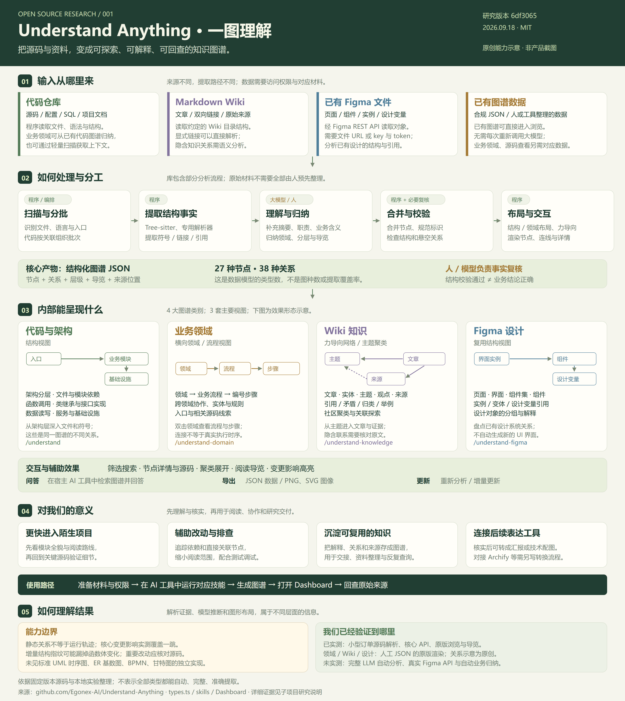
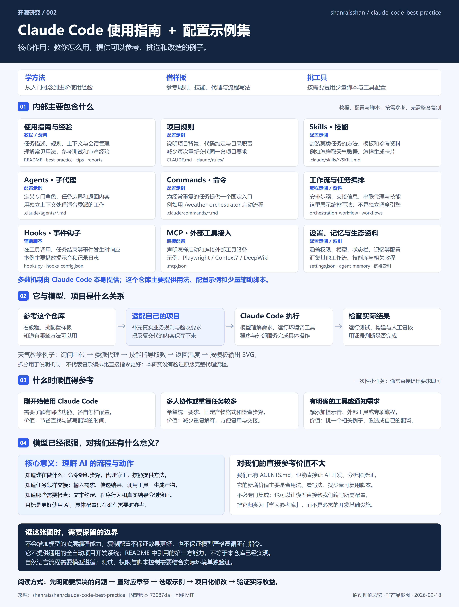
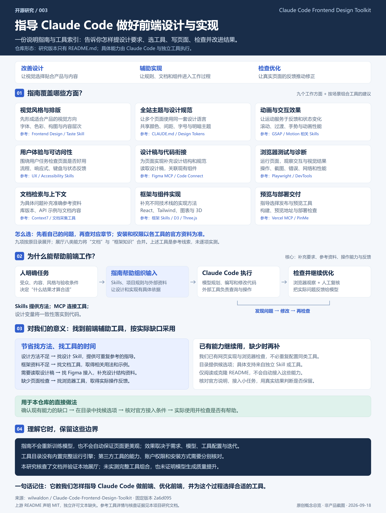
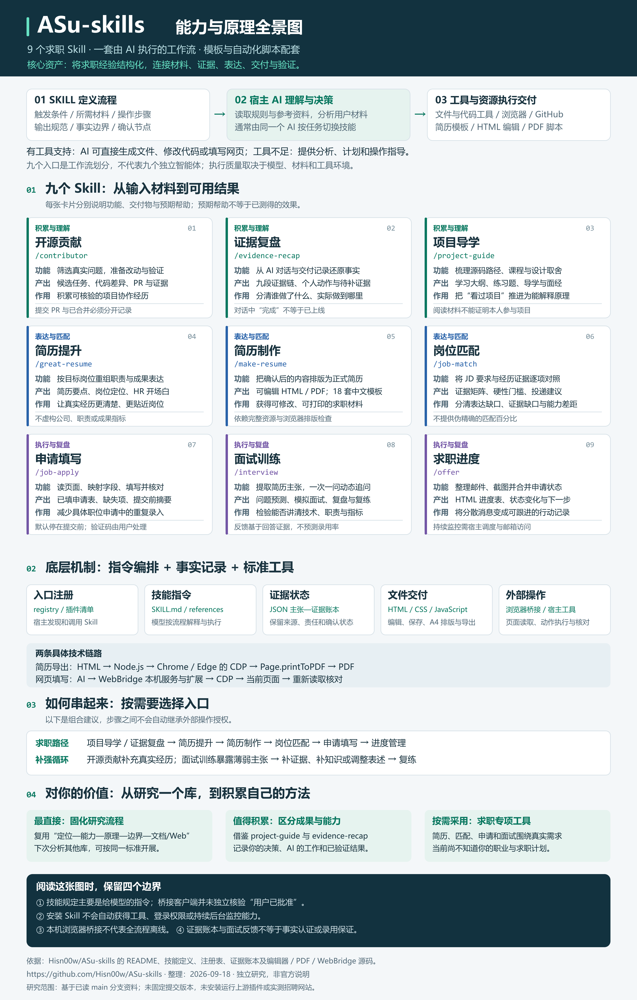
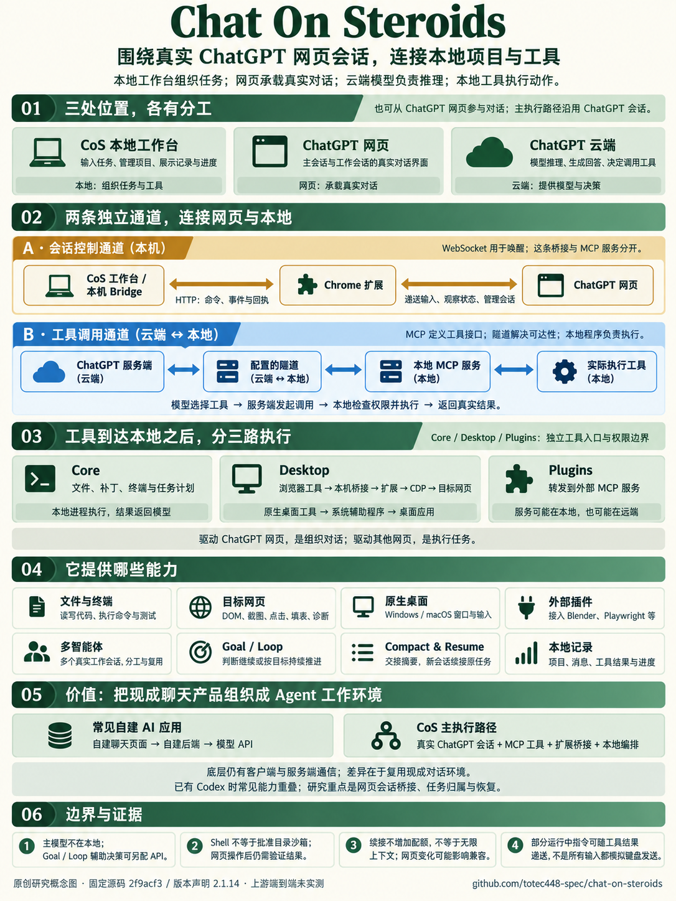
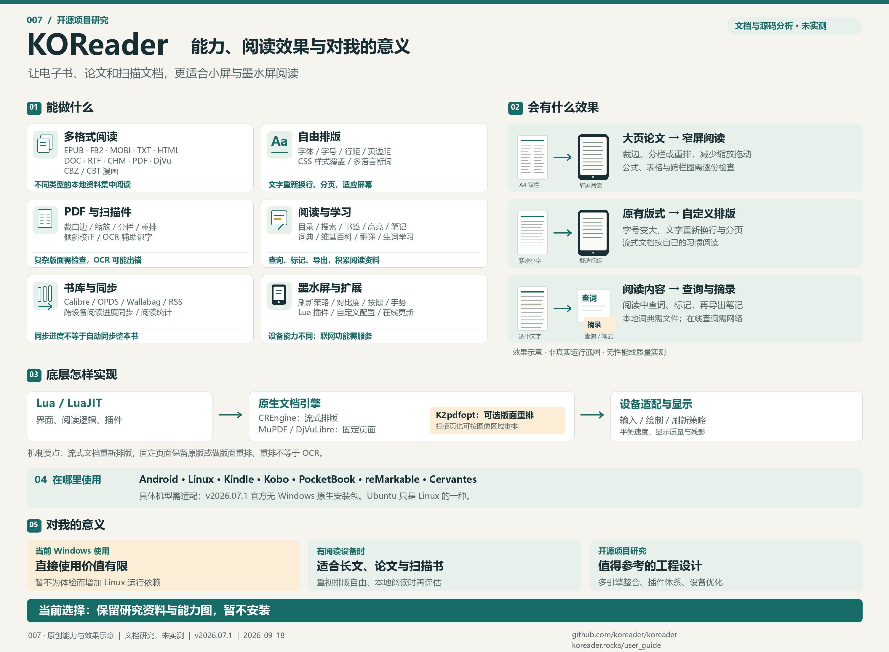
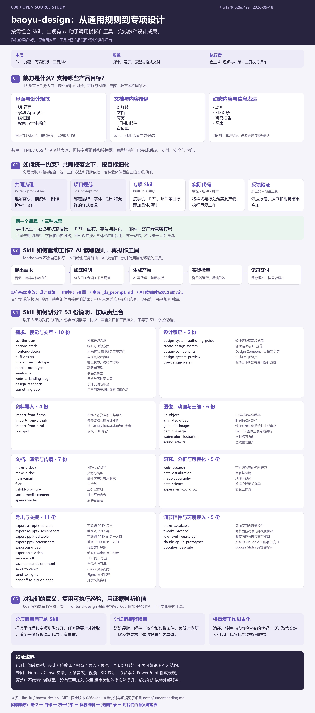
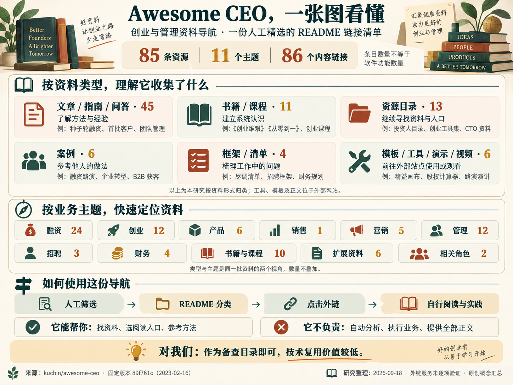

# GitHub 优秀项目研究集

持续记录值得深入研究的 GitHub 开源项目，沉淀原理分析、本地实践、二次开发和 Web 演示。

这里是研究总入口：先浏览下面的有序索引，再进入各子项目查看完整说明、效果截图和研究过程。

## 项目索引

按研究收录顺序排列，编号从 `001` 开始，创建后保持不变。

| 编号 | 源库 | 研究说明 | 能力、场景与使用价值 | 进度 | 在线演示 |
| --- | --- | --- | --- | --- | --- |
| 001 | [Understand-Anything](https://github.com/Egonex-AI/Understand-Anything) | [完整研究](projects/001-understand-anything/) | 程序提取结构，模型补充含义，将代码、Wiki、Figma 组织为交互图谱；在 AI 工具中运行分析技能后浏览、查询与导览。适合陌生项目入门、依赖排查和知识交接，为个人研究保留关系与源码线索，并辅助后续图文表达。 | 已验证 | [在线展厅](https://yydshly.github.io/0918_codex_project/001-understand-anything/) |
| 002 | [Claude Code Best Practice](https://github.com/shanraisshan/claude-code-best-practice) | [完整研究](projects/002-claude-code-best-practice/) | Claude Code 使用指南＋配置示例集。对我们当前的直接参考价值不大，核心是指导理解 AI 工作流程与动作，认识各组件分工，更好使用 AI；以引导图、配置示例和教学流程辅助理解。 | 已验证（Hooks 与本地展厅；模型流程未验证） | [在线展厅](https://yydshly.github.io/0918_codex_project/002-claude-code-best-practice/) |
| 003 | [Frontend Design Toolkit](https://github.com/wilwaldon/Claude-Code-Frontend-Design-Toolkit) | [完整研究](projects/003-frontend-design-toolkit/) | 围绕前端需求，从视觉风格、主题一致性、动效交互、用户体验与可访问性、设计稿衔接、框架与文档、浏览器验证及预览交付等角度，组织约束、方法和工具，指导 Agent 设计、实现与检查页面，以获得更符合需求的效果。 主要指导 Agent 工作，通用能力已有时增益有限。 | 已验证（文档、展厅与公网访问；第三方组合未实测） | [在线展厅](https://yydshly.github.io/0918_codex_project/003-frontend-design-toolkit/) |
| 004 | [ASu-skills](https://github.com/Hisn00w/ASu-skills) | [完整研究](projects/004-asu-skills/) | 九个求职 Skill 定义流程，宿主 AI 理解并调用工具执行；配套证据账本、简历编辑与 PDF、网页申请填写。价值在经验结构化、事实边界与可复用研究方法。 | 已验证（文档、迁移展厅与公网资源；上游插件未实测） | [在线研究手册](https://yydshly.github.io/0918_codex_project/004-asu-skills/) |
| 005 | [Chat On Steroids](https://github.com/totec448-spec/chat-on-steroids) | [完整研究](projects/005-chat-on-steroids/) | 把网页版 ChatGPT 与真实本地环境关联起来，并围绕它构建 Agent 能力。MCP 与隧道连接工具执行，扩展桥接协调网页会话，本地工作台组织项目操作、多会话分工与任务续接；重点研究这套连接和组织模式。 | 研究中（源码分析；展厅与公网已验证，上游未实测） | [在线研究展厅](https://yydshly.github.io/0918_codex_project/005-chat-on-steroids/) |
| 006 | [anbeime/skill](https://github.com/anbeime/skill) | [完整研究](projects/006-anbeime-skill/) | Skill 收集、分类与导航库，配套目录同步、数据导出和格式检查。收录内容创作与发布、图像音视频、电商营销、文档演示、知识管理、软件开发与分析等 19 类方向。对我们当前直接参考价值较低，作为资源目录备查；具体需求回原作者仓库评估，关联产品暂无明确复用价值。 | 已归档（静态研究完成；展厅与公网已验证，上游未实测） | [在线研究展厅](https://yydshly.github.io/0918_codex_project/006-anbeime-skill/) |
| 007 | [KOReader](https://github.com/koreader/koreader) | [完整研究](projects/007-koreader/) | 多格式阅读器，提供自由排版、PDF 重排、查词摘录、内容接入与墨水屏优化。当前 Windows 直接使用价值有限；有阅读设备时再评估，工程上参考多引擎整合、插件与设备适配。 | 已归档（静态研究与能力图；安装取消、产物已清理，上游未实测） | 未部署 |
| 008 | [baoyu-design](https://github.com/JimLiu/baoyu-design) | [完整研究](projects/008-baoyu-design/) | 面向 AI 编程助手的设计 Skill 工具包，支持原型、演示文稿、文档、图表与动画；通过分层规范、组件和工具指导设计交付，保持品牌与视觉一致。 | 已验证（原型、工具链、PPTX 与公网；外部服务未接入） | [已上线](https://yydshly.github.io/0918_codex_project/008-baoyu-design/) |
| 009 | [Awesome CEO](https://github.com/kuchin/awesome-ceo) | [完整研究](projects/009-awesome-ceo/) | 创业与管理资料的人工精选链接清单，通过分类与推荐语帮助寻找资料、跳转原文。收录融资、创业、产品、销售、营销、管理、招聘、财务，以及书籍课程、扩展资料和 CTO / TPM 资源，共 11 类、85 条。对我们当前直接参考价值较低，作为业务知识与阅读入口备查即可，无需技术深挖或集成。 | 已验证（资料完整性与本地中文网页；外链服务未逐项验证） | 部署中 |

## 项目图览

### 001 · Understand-Anything

核心理解：它把结构提取、语义归纳与图谱浏览组织成流程。程序负责可解析的对象与关系，大模型或人补充含义并核实；已有合规图谱可直接浏览。对我的意义是更快建立项目认识、回查关键源码、沉淀研究与交接材料；需要正式配图时，再将确认后的结论交给制图工具。

图为原创能力总览，非产品截图。结构解析与原版浏览已实测，领域 / Wiki / 设计另用人工样本验证渲染；完整 LLM 分析未验证。[在线总览](https://yydshly.github.io/0918_codex_project/001-understand-anything/overview.html) · [五工具对比](https://yydshly.github.io/0918_codex_project/001-understand-anything/#compare) · [使用说明](projects/001-understand-anything/README.md#如何使用) · [高清图](projects/001-understand-anything/assets/capability-map.png)。

### 002 · Claude Code Best Practice

核心理解：这是“Claude Code 使用指南＋配置示例集”，主要供学习用法、参考写法和按需复用脚本。对我们当前的直接参考价值不大；核心是帮助理解 AI 工作流程与动作，更好使用 AI。我们已有项目规则与 AI 开发能力，将它作为学习参考库即可，无需整库集成。图为原创概念总览，非产品截图；天气流程为固定样本模拟，原版代理端到端运行未验证。[高清总览](projects/002-claude-code-best-practice/assets/understanding-map.png) · [在线引导展厅](https://yydshly.github.io/0918_codex_project/002-claude-code-best-practice/) · [实现分析](projects/002-claude-code-best-practice/notes/research.md) · [项目适配指南](projects/002-claude-code-best-practice/notes/adaptation.md)。

### 003 · Frontend Design Toolkit

核心理解：围绕前端需求，从视觉风格、主题一致性、动效交互、用户体验与可访问性、设计稿衔接、框架与文档、浏览器验证及预览交付等角度，组织约束、方法和工具，指导 Agent 设计、实现与检查页面，以获得更符合需求的效果。 对我们而言，通用提示在现有 Agent 已能稳定完成时，额外价值可能有限；更值得保留的是项目特有的品牌与组件规范、真实资料接入和运行结果检查。图为原创概念总览，非上游产品截图；第三方组合及模型质量提升未实测。[高清总览](projects/003-frontend-design-toolkit/assets/understanding-map.png) · [Web 查看与缩放](https://yydshly.github.io/0918_codex_project/003-frontend-design-toolkit/) · [这个库的实际价值](https://yydshly.github.io/0918_codex_project/003-frontend-design-toolkit/#practice) · [完整分析](projects/003-frontend-design-toolkit/notes/research.md) · [选型指南](projects/003-frontend-design-toolkit/notes/usage.md)。

### 004 · ASu-skills

核心理解：Skill 主要指导 AI 执行工作流。宿主模型理解材料并作出决策，工具与模板完成具体交付；九个入口不等于九个独立智能体。对我们的价值是固化研究方法、区分个人决策与 AI 产出，并按实际需求使用求职能力。图为原创信息总览，非上游产品截图；没有安装运行上游插件或实测招聘网站。[完整文档](projects/004-asu-skills/notes/research.md) · [理解与应用](projects/004-asu-skills/notes/understanding.md) · [高清 PNG](projects/004-asu-skills/assets/understanding-map.png) · [矢量 SVG](projects/004-asu-skills/assets/understanding-map.svg)。

### 005 · Chat On Steroids

核心价值：把网页版 ChatGPT 与真实本地环境关联起来，并围绕它构建 Agent 能力。本地工作台组织任务，网页承载真实对话，云端模型推理；扩展桥接协调会话，MCP 与隧道接入真实工具执行，从而支持项目操作、分工与续接。图为 ImageGen 生成并核对的原创概念图，非产品截图；上游端到端未实测，研究展厅已上线并验证。[在线总览](https://yydshly.github.io/0918_codex_project/005-chat-on-steroids/#map) · [高清图](projects/005-chat-on-steroids/assets/understanding-map.png) · [完整分析](projects/005-chat-on-steroids/notes/research.md) · [审查与补充](projects/005-chat-on-steroids/notes/content-review.md)。

### 006 · anbeime/skill

核心理解：仓库主要收集、分类和展示 Skill，配套目录维护工具；收录内容创作与发布、图像音视频、电商营销、文档演示、知识管理、软件开发与分析等 19 类方向。收录某类技能不等于自身具备完整运行能力。对我们当前直接参考价值较低，作为资源目录备查；具体需求回原作者仓库评估，关联产品暂无明确复用价值。图为原创研究总览，非上游运行截图；桌面与手机交互、六项目集成和公网访问已验证。[一图理解与缩放](https://yydshly.github.io/0918_codex_project/006-anbeime-skill/#map) · [高清 PNG](projects/006-anbeime-skill/assets/understanding-map.png) · [网页关系说明](projects/006-anbeime-skill/notes/web-landscape.md) · [运行方法](projects/006-anbeime-skill/demo/README.md)。

### 007 · KOReader

核心理解：让电子书、论文和扫描文档更适合小屏与墨水屏阅读。当前 Windows 环境直接使用价值有限，保留多引擎整合、插件体系和低性能设备优化的研究参考。图为原创能力与效果示意，非产品截图；安装已取消，下载与解压目录已移入回收站，临时索引已清理，未运行、未部署。[高清总览](projects/007-koreader/assets/understanding-map.png) · [完整解读](projects/007-koreader/notes/understanding.md) · [清理记录](projects/007-koreader/notes/evidence/cleanup.json)。

### 008 · baoyu-design

baoyu-design 将设计方法、品牌规范、组件模板和执行工具组织成可组合的 Skill 工作流。用户在 AI 助手中提出设计需求，AI 按目标读取通用与专项指南，生成界面原型、演示文稿、文档、图表、动画等成果，并通过预览、检查和导出工具完成交付。其价值是复用设计规范与组件，让不同类型的成果共享一致的品牌和视觉基础；使用入口依托现有 AI 助手。

图为原创项目原理归纳，非上游产品截图。[在线介绍](https://yydshly.github.io/0918_codex_project/008-baoyu-design/) · [完整引导图](https://yydshly.github.io/0918_codex_project/008-baoyu-design/#u-map) · [详细理解](projects/008-baoyu-design/notes/understanding.md) · [实测研究](projects/008-baoyu-design/notes/research.md) · [运行方法](projects/008-baoyu-design/demo/README.md)。

### 009 · Awesome CEO

它是一份创业与管理资料导航，作为备查目录即可，技术复用价值较低。图为原创概念汇总，非产品截图；展示资料类型、11 个主题、使用方式与边界。中文网页完整保留 85 条资源与 86 个内容链接，可按六组类型展开阅读。本地交互已验证，未发布到公网。[放大总览图](projects/009-awesome-ceo/demo/overview.html) · [打开中文网页](projects/009-awesome-ceo/demo/index.html) · [运行说明](projects/009-awesome-ceo/demo/README.md)。

## 仓库导航

| 入口 | 内容 |
| --- | --- |
| [研究项目](projects/) | 按编号组织的独立子项目 |
| [子项目模板](templates/project/) | 项目介绍、图片、研究记录与演示说明 |
| [收录与编号约定](docs/CONVENTIONS.md) | 新增项目步骤、目录规范和索引维护 |
| [Web 部署约定](docs/DEPLOYMENT.md) | 多个演示的路径规划和部署记录要求 |

## 新增研究项目

1. 查看索引和 Git 历史，复制 `templates/project/` 到下一个未使用编号的子目录；当前下一编号为 `010`。
2. 填写子项目 README，记录上游仓库、研究目标及版本信息。
3. 添加实际截图和研究记录，再更新本页索引与图览。
4. 有可运行的演示后，在子项目中记录启动方法和实际部署地址。

详细操作见[收录与编号约定](docs/CONVENTIONS.md)。当前已收录 9 个研究项目，001—006 与 008 的 7 个 Web 演示均已上线并完成公网验证，沿用各自编号子路径；007 已完成静态研究与能力图，安装取消并清理，未运行、未部署；008 已完成原型、设计系统工具链、PPTX 演示和公网验证，保留完整理解引导图；009 已完成中文全量资源网页、分类汇总、搜索与本地验证，未发布到公网。[打开演示总入口](https://yydshly.github.io/0918_codex_project/)。

## 来源与许可

每个研究项目单独标注上游来源、版本和许可证。引用或修改第三方代码时保留其许可与版权声明；本仓库尚未为原创内容指定统一开源许可证。
