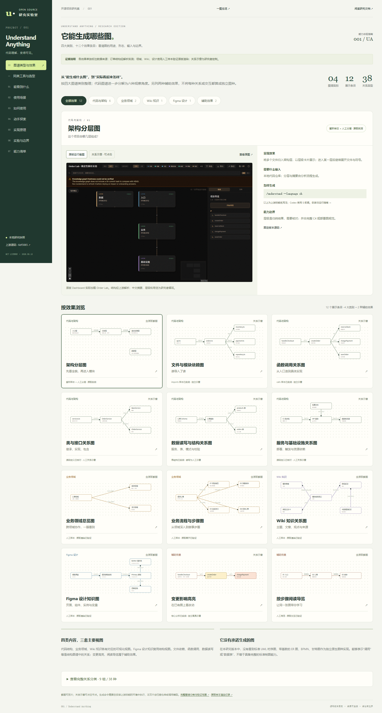

# 001 · Understand-Anything

**Understand-Anything 将代码仓库、约定格式的 Wiki 和已有 Figma 设计组织成可探索的知识图谱。** 程序提取文件、符号、链接和引用，大模型补充职责、业务含义、分层和导览；适合陌生项目入门、关系排查、研究资料整理和团队交接。在支持其技能的 AI 工具中准备材料并执行分析，再打开 Dashboard 浏览、回查来源与提问。

对我的意义是把一次性的“看代码、读资料”沉淀成可反复使用的关系地图和理解线索。它也封装了部分分析流程；业务结论仍需要模型或人理解、取舍与复核。已有合规图谱数据可直接浏览，无需每次重新调用模型。

| 项目 | 内容 |
| --- | --- |
| 上游 | [Egonex-AI/Understand-Anything](https://github.com/Egonex-AI/Understand-Anything) |
| 研究版本 | [`6df3065f1d8ddc2ce3615314d1d493f36d6b1c80`](https://github.com/Egonex-AI/Understand-Anything/tree/6df3065f1d8ddc2ce3615314d1d493f36d6b1c80) |
| 上游许可证 | MIT；[版权与许可](THIRD_PARTY_NOTICES.md) |
| 研究进度 | 已验证：样本核心 API、原版浏览交互与人工领域 / Wiki / 设计样本渲染；四类图谱展厅完成 |
| 收录 / 最近验证 | 2026-09-18（Asia/Shanghai） |
| 展示技术 | 原生 HTML / CSS / JavaScript，无运行时依赖；实验使用上游 TypeScript 核心库 |
| 在线演示 | [GitHub Pages 展厅](https://yydshly.github.io/0918_codex_project/001-understand-anything/) · [一图总览](https://yydshly.github.io/0918_codex_project/001-understand-anything/overview.html) · [工具对比](https://yydshly.github.io/0918_codex_project/001-understand-anything/#compare) |

## 我们的理解

| 关注点 | 研究结论 |
| --- | --- |
| 能力与原理 | 原始材料 → 程序扫描与结构提取 → 模型 / 人补充含义 → 合并校验图谱 → 布局与交互。图中关系、语义解释和视觉布局应分别看待。 |
| 输入来源 | 本地源码、配置、SQL 和项目文档；约定的 Markdown Wiki 与来源资料；经授权的 Figma API；已经整理好的图谱 JSON。不是任意资料都能无条件自动分析。 |
| 图谱效果 | 代码结构、业务领域、Wiki 知识、Figma 设计四类内容；代码可观察分层、依赖、调用、类型、数据与基础设施关系，附导览与变更高亮。不是通用 UML / ER / BPMN 制图全集。 |
| 适用场景 | 接手新仓库先看全貌；修改前追踪关联；查找功能入口；传递项目知识；将文章与来源关联；盘点已有设计的组件与变量。 |
| 如何用 | 在目标项目的 AI 环境安装上游技能，运行对应的分析入口，生成图谱后打开 Dashboard；浏览节点和源码，按需提问与更新。网页中的静态展厅用于学习，不会替用户扫描仓库。 |
| 对我的意义 | 减少反复摸索结构的工作，建立阅读路线，保存关系与来源，辅助长期研究与交接；具体节省时间或模型费用的收益尚未测量。 |
| 与类似工具的关系 | 与 Graphify 在提取建图上重合，更强调解释与导览；Archify、Diagram Design、Fireworks 侧重把确认后的内容制成图。组合需要转换格式与核实，未自动接通。 |
| 判断边界 | 语法提取不保证无遗漏，模型归纳不等于事实，静态关系不等于运行时行为。已验证范围见下文；完整 LLM 生成质量尚未验证。 |

## 如何使用

1. **准备材料与环境**：代码仓库放在本地；Wiki 按上游约定组织；Figma 分析准备已有文件与合法访问权限。按[固定版本上游说明](https://github.com/Egonex-AI/Understand-Anything/blob/6df3065f1d8ddc2ce3615314d1d493f36d6b1c80/README.md)安装对应 AI 工具的技能入口。
2. **按目标分析**：代码使用 `understand`；业务领域使用 `understand-domain`；Wiki 使用 `understand-knowledge`；Figma 使用 `understand-figma`。各入口的参数、环境要求与验证范围见[图谱分类](notes/graph-types.md)。
3. **浏览与核对**：生成图谱后运行 `understand-dashboard`，从模块、节点和导览进入，回查源码或原始来源。已有图谱可以反复浏览；源码查看仍需对应项目文件。
4. **继续研究**：需要问答时使用 `understand-chat`；辅助评审改动时使用 `understand-diff`。重要逻辑变化后重新分析并核对，不能只依赖结构指纹决定摘要是否过期。

以上为技能名称，实际命令写法随所用宿主而异。[在线展厅的“如何使用”页](https://yydshly.github.io/0918_codex_project/001-understand-anything/#guide)提供分工具指南；该安装与完整模型分析流程没有在本机端到端执行。网页已通过 GitHub Pages 发布，也可下载后打开或按下文启动本地服务。

## 先看展示

### 一张图理解完整能力

[](https://yydshly.github.io/0918_codex_project/001-understand-anything/overview.html)

[打开可缩放总览](https://yydshly.github.io/0918_codex_project/001-understand-anything/overview.html) · [高清 PNG](assets/capability-map.png) · [SVG 矢量图](assets/capability-map.svg)

图中串起代码 / Wiki / Figma / 已有图谱输入、程序与模型的分工、四类图谱与辅助交互、使用价值和能力边界。这是依据固定源码与实验整理的原创说明，不是原版产品截图。SVG 为 1800×2020，PNG 为 3600×4040；文字无重叠、无越界，缩放与手机阅读检查通过。[验证记录](notes/evidence/overview-qa.json)。

### 分类效果展厅

直接访问[在线分类效果展厅](https://yydshly.github.io/0918_codex_project/001-understand-anything/)，不需要安装依赖。本地使用可下载后用浏览器打开 [demo/index.html](demo/index.html)，或在研究仓库根目录启动静态服务：

```powershell
python -m http.server 8765 --bind 127.0.0.1
```

然后访问 <http://127.0.0.1:8765/projects/001-understand-anything/demo/>。这是启动服务后的本地入口，不是已上线地址。

[](https://yydshly.github.io/0918_codex_project/001-understand-anything/#gallery)

*本研究网页的真实截图。订单结构来自上游核心库与样本适配；领域、Wiki、设计截图使用人工 JSON 验证原版渲染；关系示意为研究者绘制。未执行完整 LLM 流水线。*

展示包括：

- **同类工具与选型**：将本库与已研究的 Graphify、Archify、Diagram Design、Fireworks 对照，涵盖输入、处理、模型分工、产物、用途与验证范围；提供七种场景建议、同题示例、三种组合工作流和历史研究入口。[网页对比](https://yydshly.github.io/0918_codex_project/001-understand-anything/#compare) · [文字对照](notes/comparison.md)。
- **图谱类型与效果（默认首页）**：按代码与架构、业务领域、Wiki 知识、Figma 设计四类筛选；代码类细分六种观察角度，另列变更高亮和阅读导览，总计十二个效果条目。每项含示意、输入、生成技能、边界与源码；可切换原版截图和可点击示意。[详细分类](notes/graph-types.md)。
- **能看到什么**：原版架构层、源码详情、阅读导览三张真实运行截图，可切换并查看大图；附明确标注的预写问答示例。
- **使用场景**：接手项目、评审改动、定位逻辑、梳理业务、浏览 Wiki。每项包含问题、操作路线、预期结果和能力边界。
- **如何使用**：Codex（Windows / macOS / Linux）、Claude Code、Cursor 四种配置，安装 → 分析 → 浏览 → 提问 → 更新五步指南，支持复制命令。
- **图谱探索**：函数 / 数据表与文件视图切换、文本筛选、节点源码和行号、上下游跳转、JSON 导出。
- **修改影响**：选择变更文件，读取上游 `buildDiffContext` 的实际结果，高亮改动节点和一跳邻居。
- **阅读导览**：以研究者编写的路线演示入口、订单、库存、支付和保存的阅读顺序。
- **实现原理**：七阶段数据流，每一步链接固定版本的上游源码。
- **实验与边界**：展示函数体变化漏判、一跳影响限制、语义搜索接入状态和验证范围。
- **能力清单**：明确“已实测”“源码研究”“未端到端运行”。

## 它解决什么问题

Understand-Anything 将文件、函数、类等对象组织成节点，将导入、调用、依赖等组织成边。Tree-sitter 与专用解析器提取结构，大模型补充摘要、业务含义、架构层与导览，生成可保存和共享的图谱 JSON。它适合陌生仓库入门、架构阅读、团队知识传递及改动前的辅助排查。

完整产品还提供项目问答、局部解释、业务领域提取和特定 Markdown Wiki 分析。本次对这些依赖模型的功能进行了源码研究，没有验证它们的模型输出质量。

## 本次实际验证

| 实验 | 结果 | 证据 |
| --- | --- | --- |
| TypeScript 结构解析 | 5 个函数，包含参数、返回类型、行号 | [原始结构](notes/evidence/structures.json) |
| SQL 解析 | orders 表及 3 个字段 | [提取入口输出](notes/evidence/extraction.json) |
| 图谱组装与校验 | 12 个节点、14 条边；6 包含、4 导入、4 调用 | [图谱 JSON](notes/evidence/graph.json) |
| 上游模糊搜索 | `chargePayment` 定位到函数；未知词无结果 | [实验结果](notes/evidence/experiments.json) |
| 支付文件改动 | 订单节点受影响，间接依赖的入口不在一跳结果中 | [影响分析](notes/evidence/impact.json) |
| 增量更新边界 | 上限 100 → 10，输入 50 的返回值 true → false；被判为 COSMETIC / SKIP | [实验结果](notes/evidence/experiments.json) |
| 浏览器验证 | 23 组检查通过，九视图桌面 / 手机可用；12 条目、分类、原版图片与节点交互通过 | [浏览器记录](notes/evidence/browser-qa.json) |
| 公网部署 | GitHub Pages 已上线；7 组检查覆盖导航、版本、图片与下载、工具对比、总览缩放、刷新与手机布局 | [部署记录](notes/evidence/deployment.json) |
| 同类工具对比 | 7 组专项检查；七场景、五工具详情、历史版本、入口、刷新、键盘与三种屏宽 | [对比页记录](notes/evidence/comparison-qa.json) |
| 原版 Dashboard | 实际加载样本、展开业务层、打开源码、前进阅读导览 | [原版运行记录](notes/evidence/upstream-dashboard.json) |
| 新增原版渲染 | 人工领域 / Wiki / 设计样本加载；领域深入流程、设计展开聚类；4 张真实截图 | [渲染记录](notes/evidence/gallery-rendering.json) |
| 相关上游测试 | 6 个测试文件，140 项通过、1 项跳过 | [测试记录](notes/evidence/upstream-tests.md) |

**关键结论：结构未变化，不代表业务逻辑未变化。** 本版本的指纹比较可能跳过函数体内部修改，因此依赖增量更新的业务摘要有过时风险。该结论已在样本中验证，但不意味着所有函数体修改都会被跳过。

## 复现实验

验证环境：Windows x64、Node.js 24.19.0、pnpm 11.19.0、上游锁文件依赖、Microsoft Edge 153.0.4234.32。

从本子项目目录运行：

```powershell
# 需要 Git、Node.js 24+、pnpm；首次需下载上游与依赖。
./code/reproduce.ps1

# 或复用一个已经安装依赖并构建 core 的、未修改的固定版本上游副本：
node ./code/run-experiments.mjs "C:/path/to/Understand-Anything"
```

脚本会检查上游 commit，输出 `notes/evidence/*.json` 并刷新 `demo/data.js`。上游副本放在已忽略的 `upstream-local/`，不提交依赖或嵌套 Git 仓库。时间戳会随复现更新；样本哈希用于核对输入。实验通过不代表整个上游产品端到端通过。

上游仓库声明 pnpm 10.6.2；本次工具环境实际使用 11.19.0，并以 `--frozen-lockfile --ignore-scripts` 安装、显式构建 core。差异和警告见研究笔记。

## 目录与延伸研究

- [研究笔记](notes/research.md)：源码路径、算法、实验方法、限制与后续问题。
- [展示运行说明](demo/README.md)：启动、静态子路径、浏览器验证与部署状态。
- [实验入口](code/run-experiments.mjs)：调用上游 API 并产生可核对的证据。
- [样本](code/fixture/)：原创代码，支付与保存均为模拟字符串，不连接真实服务。
- [注释数据](code/annotations.json)：中文用途说明与分层，和解析事实分开保存。
- [素材来源](assets/README.md)：真实截图的生成方式与适用范围。

后续可单独研究完整多代理流水线、真实大型仓库的跨语言解析质量、域模型提取效果，以及函数体变化导致摘要过时的改进方案。这些均未计入本轮已验证范围。

---

[返回总索引](../../README.md) · [上游固定版本](https://github.com/Egonex-AI/Understand-Anything/tree/6df3065f1d8ddc2ce3615314d1d493f36d6b1c80)
