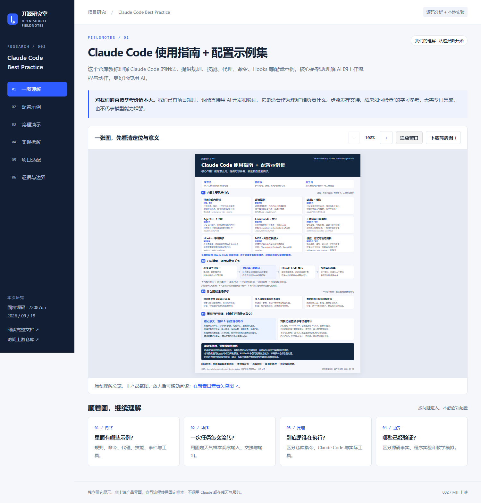

# 002 · Claude Code Best Practice

这个仓库的核心定位是 **Claude Code 使用指南＋配置示例集**：收集从入门到进阶的使用经验，提供可以参考、挑选和改造的规则、技能、代理、工作流配置与少量辅助脚本。推理、代理运行和工具调度主要由 Claude Code 提供。

本子项目用中文文档和交互网页分析“有什么能力、如何实现、怎样适配项目、哪些结论已经验证”。

## 一张图理解定位与价值

[](assets/understanding-map.png)

原创概念总览，非产品截图。阅读顺序为：定位 → 内部组成 → 与模型、项目的关系 → 适用场景 → 对我们的意义 → 能力边界。[高清 PNG](assets/understanding-map.png) · [可编辑 SVG](assets/understanding-map.svg)。

**对我们的结论：直接参考价值不大。** 我们已有 AGENTS.md，也能直接使用 AI 开发和验证。它的核心意义是指导我们理解 AI 工作流程与动作：谁负责什么、任务怎样交接、工具怎样执行、结果如何检查，从而更好使用 AI。把它作为按需查阅的学习参考库即可，无需整库集成；它不能增加模型的底层能力，也不能保证开发效果或效率提高。

## 项目信息

| 项目 | 内容 |
| --- | --- |
| 编号 | `002` |
| 上游 | [shanraisshan/claude-code-best-practice](https://github.com/shanraisshan/claude-code-best-practice) |
| 研究版本 | [`73087da5e272fc197d7f9f29492d153fe1aaaefe`](https://github.com/shanraisshan/claude-code-best-practice/tree/73087da5e272fc197d7f9f29492d153fe1aaaefe) |
| 上游提交时间 | 2026-09-18 03:42:33 UTC |
| 上游许可证 | MIT，Copyright (c) 2025–2026 Shayan Rais；[许可证副本](licenses/upstream.LICENSE) |
| 研究进度 | 已验证：限定为来源文件校验、Hooks 隔离实验和本地网页；Claude Code 端到端流程未验证 |
| 本地技术栈 | 原生 HTML / CSS / JavaScript；实验使用 Python，网页 QA 使用 Playwright / Edge |
| 收录 / 验证日期 | 2026-09-18 |
| 在线状态 | 已上线：[打开引导展厅](https://yydshly.github.io/0918_codex_project/002-claude-code-best-practice/) |

## 展厅与阅读入口

- [在线引导展厅](https://yydshly.github.io/0918_codex_project/002-claude-code-best-practice/)：以可缩放引导图为入口，按问题进入配置示例、任务流程、实现原理与验证边界。
- [研究笔记](notes/research.md)：关键文件、调用关系、运行原理与发现的问题。
- [项目适配指南](notes/adaptation.md)：将参考模式用于功能开发、缺陷修复和开源研究。
- [运行与部署说明](demo/README.md)：离线使用、本地服务、网页检查和编号路径。



*这是本研究编写的网页截图，非上游产品界面。天气流程使用固定教学样本，不调用在线模型或天气服务。*

## 能力概览

| 组件 | 解决的问题 | 代表文件 | 能力边界 |
| --- | --- | --- | --- |
| 项目规则 | 让模型理解项目背景、目录与工作约定 | `CLAUDE.md`、`.claude/rules/` | 自然语言规则需要模型遵循，不等于强制校验 |
| Commands | 将重复操作组织成固定入口和步骤 | `weather-orchestrator.md` | 是指令驱动的编排，不是独立的事务工作流引擎 |
| Agents | 专项任务分工与上下文隔离 | `weather-agent.md` | 依赖 Claude Code；需验证工具权限和模型配置 |
| Skills | 复用方法、参考资料与输出模板 | `weather-fetcher/`、`weather-svg-creator/` | Markdown 本身不会执行网络或文件操作 |
| Hooks | 响应事件、播放声音并记录日志 | `hooks.py`、`settings.json` | 当前脚本主要是通知，不是测试或审查门禁 |
| MCP 配置 | 连接 Playwright、Context7、DeepWiki | `.mcp.json` | 工具能力来自外部服务，不由本仓库实现 |

上游 README 还收集工作流、教程和第三方项目。**链接到某项功能或工具，不表示本仓库实现了该功能。**

## 核心原理

```text
项目需求与验收条件
    ↓
项目约定 + Command 流程 + Agent 分工 + Skill 方法
    ↓
Claude Code：加载上下文 → 模型决策 → 工具调用 → 读取结果
    ↓
文件 / Shell / HTTP / MCP 工具产生真实操作结果
    ↓
Hook 事件反馈 + 实际检查 + 人工复核
```

天气示例的指令链是：询问 C/F → 委派 weather-agent → 调用 weather-fetcher → WebFetch 请求 Open-Meteo → 返回温度与单位 → weather-svg-creator 按模板输出 SVG 和摘要。

**实现中的关键区别：**“必须先获取有效温度”写在提示词中，依赖模型遵循；配置解析、工具权限和脚本条件分支才属于运行环境或程序执行的部分。本网页用确定性的 JavaScript 模拟成功与失败分支，不能作为原版模型遵循度的证明。

## 已做的验证

| 验证 | 实际结果 | 记录 |
| --- | --- | --- |
| 来源固定 | 下载并校验 17 个选定文件 SHA-256，固定到同一 commit | [sources.json](notes/evidence/sources.json) |
| Hooks 隔离实验 | 13 项通过：含来源校验、事件映射、提交识别、配置覆盖、日志与异常退出 | [experiments.json](notes/evidence/experiments.json) |
| 展厅交互 | 能力、分层与场景切换，成功 / 失败分支、单位重置、SVG 下载、刷新与离线打开 | [browser-qa.json](notes/evidence/browser-qa.json) |
| 展厅布局 | 桌面、平板、手机及 320px 窄屏；桌面 200% 字号检查 | [真实截图](assets/README.md) |
| 总站集成 | 两项目构建、原有导航保留、编号根路径重写和文档链接通过；真实暂存区未变 | [integration.json](notes/evidence/integration.json) |

未运行 Claude Code 的完整命令、子代理或记忆流程；未安装或连接 MCP 服务；未验证真实音频播放；未测量开发效率提升。

## 在线访问

[打开正式展厅](https://yydshly.github.io/0918_codex_project/002-claude-code-best-practice/)。默认先看引导图，可缩放、下载，并按问题进入配置示例与流程分析。2026-09-18 已验证公网资源、关键交互与手机布局，001 展厅保持可用。详见 [部署记录](notes/evidence/deployment.json)。

## 快速开始

直接用浏览器打开 [demo/index.html](demo/index.html)，即可离线查看内容与交互；上游来源链接需要联网。

也可在仓库根目录运行：

```powershell
python -m http.server 8766 --bind 127.0.0.1
```

本地地址：<http://127.0.0.1:8766/projects/002-claude-code-best-practice/demo/>。该地址仅在本机服务运行时有效。

展厅无需安装依赖，也无需模型账户。原版流程必须在安装并登录 Claude Code 的环境中另行验证。若复用上游配置，应先核对兼容性，而不是把研究展厅当成原版执行器。

## 主要发现与价值

1. **最值得复用的是职责划分。** Command 管交接，Agent 管专项任务，Skill 管方法，Hook 管事件反馈。
2. **文档与文件存在漂移。** 流程说明强调预加载；当前代理正文要求显式调用 Skill，应以固定版本的具体文件和实测为准。
3. **权限声明尚有兼容性疑点。** 代理使用 `allowedTools`，官方文档列出的子代理字段是 `tools`，本研究未验证前者是否被识别。
4. **项目适配仍需工程检查。** 对自己的项目，应补上可运行的测试、构建、失败判定和交付检查，不能仅增加提示词长度。

## 来源与改动

网页、中文分析及实验脚本为本研究编写。网页展示少量上游配置摘录和研究者概括，保留 [第三方声明](THIRD_PARTY_NOTICES.md) 及上游 MIT 许可证。上游文件仅下载到仓库忽略的 `upstream-local/` 供验证，不将其 `.claude` 配置安装到本研究仓库，也不提交嵌套克隆。

来源记录中的 SHA-256 用于校验固定文件，不代表运行结果或安全认证。研究结论的适用范围限于所列版本。

---

[返回总索引](../../README.md#项目索引) · [图片来源](assets/README.md) · [演示说明](demo/README.md)
