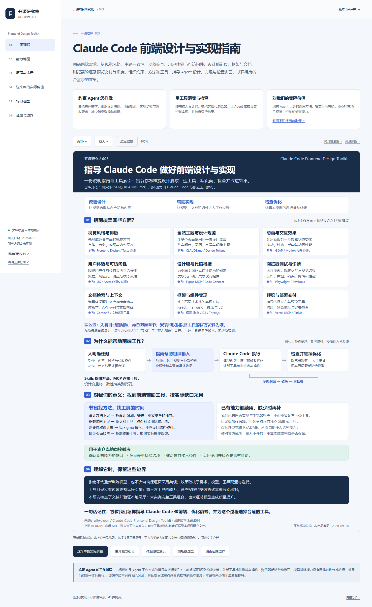

# 003 · Claude Code Frontend Design Toolkit

围绕前端需求，从视觉风格、主题一致性、动效交互、用户体验与可访问性、设计稿衔接、框架与文档、浏览器验证及预览交付等角度，组织约束、方法和工具，指导 Agent 设计、实现与检查页面，以获得更符合需求的效果。

它提供的是 Agent 工作方式的指导与资源索引：Skill 和项目规则约束决策，外部工具提供资料与操作，浏览器反馈帮助修正。模型基础能力没有因此被训练或升级，效果仍取决于实际执行。 对我们而言，通用提示在现有 Agent 已能稳定完成时，额外价值可能有限；更值得保留的是项目特有的品牌与组件规范、真实资料接入和运行结果检查。 该研究版本只有 README.md，独立 Skill 与工具需要按需配置。

## 项目信息

| 项目 | 内容 |
| --- | --- |
| 固定编号 | `003` |
| 上游仓库 | [wilwaldon/Claude-Code-Frontend-Design-Toolkit](https://github.com/wilwaldon/Claude-Code-Frontend-Design-Toolkit) |
| 研究版本 | [`2a6d0958e6966e0003896f94ce5003466e89e91d`](https://github.com/wilwaldon/Claude-Code-Frontend-Design-Toolkit/tree/2a6d0958e6966e0003896f94ce5003466e89e91d) |
| 上游提交时间 | 2026-04-11T11:57:59Z |
| 上游许可证 | README 声明 MIT，但固定版本缺少所链接的 LICENSE；许可文本未核实 |
| 研究进度 | 已验证（文档核查、展厅与公网访问；第三方工具组合未实测） |
| 展示技术 | 原生 HTML / CSS / JavaScript；无需构建或安装依赖 |
| 收录 / 核查日期 | 2026-09-18 |
| 在线演示 | [已上线 · 一图理解](https://yydshly.github.io/0918_codex_project/003-frontend-design-toolkit/) |

## 阅读入口

- [在线引导展厅](https://yydshly.github.io/0918_codex_project/003-frontend-design-toolkit/) · [公网验证记录](notes/evidence/deployment.json) · [003 交互与引导图核对](notes/evidence/deployment-project.json)。

- [Web 展厅](demo/index.html)：一图理解、能力地图、原理与演示、这个库的实际价值、场景选型、证据与边界。
- [这个库的实际价值](demo/index.html#practice)：围绕同一个咖啡首页需求，串联目录选型、资源接入、任务中使用和结果检查。
- [完整研究文档](notes/research.md)：定位、能力分工、机制分析、纠错与验证限制。
- [使用与选型指南](notes/usage.md)：怎样将这份目录用于实际前端项目。
- [来源版本记录](notes/evidence/sources.json)、[浏览器检查](notes/evidence/browser-qa.json)、[站点集成检查](notes/evidence/integration.json)。
- [编号路径浏览器检查](notes/evidence/browser-built-qa.json)、[三项目站点回归检查](notes/evidence/site-qa.json)。

## 一张图理解定位与价值

[](assets/understanding-map.png)

核心理解：围绕前端需求，从视觉风格、主题一致性、动效交互、用户体验与可访问性、设计稿衔接、框架与文档、浏览器验证及预览交付等角度，组织约束、方法和工具，指导 Agent 设计、实现与检查页面，以获得更符合需求的效果。 它提供的是 Agent 工作方式的指导与资源索引：Skill 和项目规则约束决策，外部工具提供资料与操作，浏览器反馈帮助修正。模型基础能力没有因此被训练或升级，效果仍取决于实际执行。

图中按上游目录展开九个方面：视觉风格、全站主题、动效交互、用户体验、设计稿衔接、浏览器测试、文档检索、框架实现、预览部署，并说明选型组合、执行原理与证据边界。展厅原有八类能力将文档与框架知识合并，两种组织方式范围一致。

这是原创概念总览，非上游产品截图。[高清 PNG](assets/understanding-map.png) · [可编辑 SVG](assets/understanding-map.svg) · [Web 查看与缩放](demo/index.html#overview) · [图片核查记录](notes/evidence/understanding-map.json)。

## 展示预览



图为本研究制作的 Web 展厅实际浏览器截图，非上游产品界面，也不是 Claude 生成质量的对比实验。[图片来源](assets/README.md)。

## 主要结论

| 问题 | 结论 | 依据 |
| --- | --- | --- |
| 仓库自身实现了什么？ | 工具分类、说明、组合建议；没有运行引擎或一键整合程序 | 固定版本文件树只有 README.md |
| 设计 Skill 怎样起作用？ | 设计原则和工作步骤进入模型上下文，影响生成与自查 | Anthropic Frontend Design 指令文件 |
| MCP 增加什么？ | 给模型提供外部资料和可调用操作，例如检索文档、操作浏览器 | Context7 与 Playwright MCP 官方说明 |
| 如何保持多页一致？ | 项目规则约束工作，组件共享设计变量；实际代码必须落实约定 | 研究归纳 + 展厅真实 CSS 变量实验 |
| 是否已经证明生成质量提升？ | 没有。文档解释机制，静态演示只验证展示实现 | 本轮没有模型对照实验 |
| 对本仓库有什么价值？ | 以需求为目标，从设计、实现、验证等角度约束 Agent；已有通用能力增益有限，按需补充项目规范和工具 | 研究建议；无需将上游作为应用依赖 |

## 本地打开

直接在浏览器打开 `demo/index.html` 可离线使用全部交互。也可在本仓库根目录启动静态服务：

```powershell
python -m http.server 8767 --bind 127.0.0.1
```

随后打开 [本地展厅](http://127.0.0.1:8767/projects/003-frontend-design-toolkit/demo/)。此地址仅在本机服务运行时有效，不是公网部署。

演示不接入模型或账户，不执行第三方插件安装。文档与引用链接可从页面进入；外部来源需联网访问。运行和检查方法见 [demo/README.md](demo/README.md)。

## 已知限制

- 能力按研究目的归并成八类，不代表上游工具数量或本机安装数量。
- 六步流程是预设教学内容，未执行真实模型与 MCP 调用。
- 色相滑块真实修改 CSS 变量；使用 HSL 便于观察，不是上游 OKLCH 工具的复刻或质量评测。
- 未逐项安装目录中的工具，未测试 Figma、托管平台或完整组合，未测量模型输出质量、Token 节省和性能收益。
- 上游 Chrome DevTools 的归属及包名与官方资料不一致，安装应回查官方文档；详细说明见研究笔记。

## 来源与改动

本子项目包含原创中文分析、展厅代码与实际截图，没有引入上游工具源代码或复制完整 README。引用使用固定版本链接。许可缺口及第三方边界见 [THIRD_PARTY_NOTICES.md](THIRD_PARTY_NOTICES.md)。

[返回根索引](../../README.md#项目索引)
