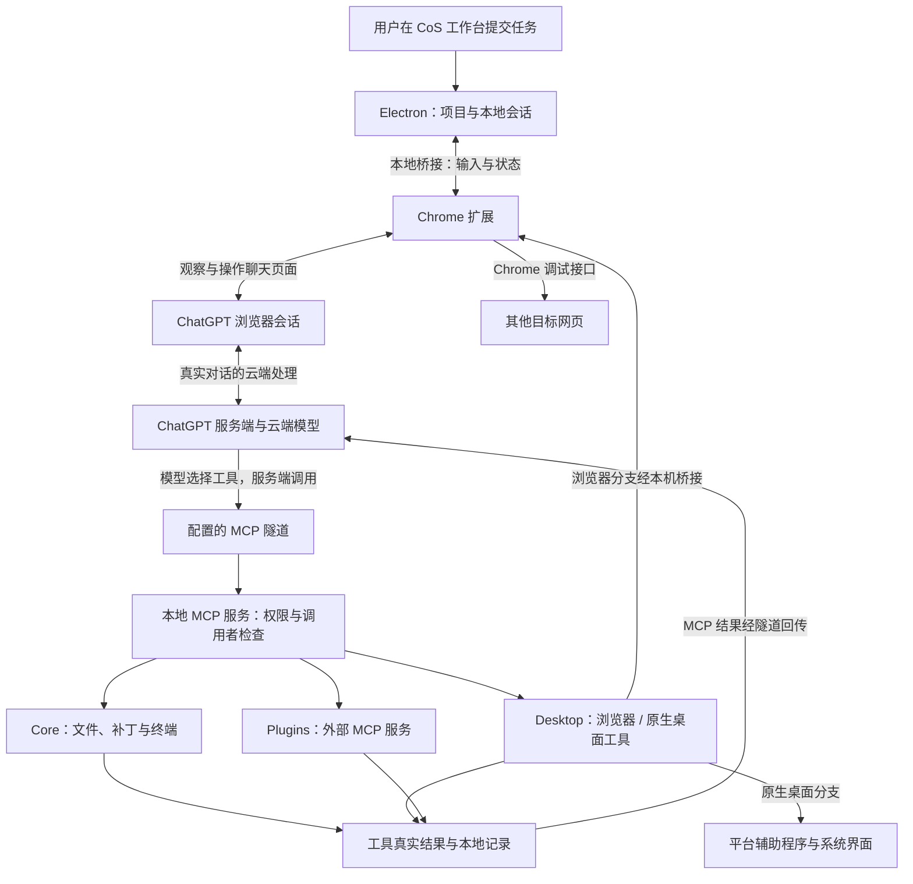

# 能力、原理与价值分析

研究对象固定为 `totec448-spec/chat-on-steroids@2f9acf307189ed1f05bee0cdc97871fdcff1d8f5`，包版本声明 `2.1.14`。研究日期为 2026-09-18。本次阅读源码并验证原创静态展厅；没有编译、安装或端到端运行上游。后文“实现”表示源码可见，不等于实际账号和电脑环境中已验证。

## 1. 它到底是什么

**核心价值：把网页版 ChatGPT 与真实本地环境关联起来，并围绕它构建 Agent 能力。** 真实网页对话成为任务的交互载体，MCP 与隧道把模型工具调用连接到实际项目和执行环境，扩展与本地工作台负责会话协调、任务记录、分工和续接。这是本研究最终保留的摘要；与 Codex 的比较用于理解能力重叠，不代替对该架构价值的说明。

它是围绕 ChatGPT 浏览器会话搭建的 Agent 运行与编排工作台。模型在 ChatGPT 云端执行，网页承载真实会话；本地 Electron 应用负责工具、会话记录、任务状态与界面，Chrome 扩展把浏览器会话连接到本地任务。你可以在本地工作台发起任务，也可以从 ChatGPT 网页参与；本地显示的是围绕真实会话组织的工作视图，不是本地运行一个 ChatGPT 模型。

它组织的是 ChatGPT 主会话与工作会话。不能因为源码目录存在 `codex/` 就将整个产品理解为调用 Codex CLI 或调度一组 Codex 进程；README 明确说明主路径使用 ChatGPT 会话，而不是直接调用 Codex。项目包含部分 Codex 兼容或派生工具实现，具体复用应连同上游第三方声明阅读。

产品价值可拆为三层：让模型获得执行能力；让多个会话协作；让长任务具有可恢复的历史和控制状态。常见执行能力与 Codex 重叠，主要差异在入口、实现路径和可定制的编排机制，而非天然更强的模型。

更有辨识度的设计是复用现成 ChatGPT 对话环境，从外部连接本地工具并组织工作流。常见自建 AI 应用使用“自建聊天前端 → 自建后端 → 模型 API”；CoS 主执行路径则是“真实 ChatGPT 会话 + MCP + 扩展 + 本地编排”。底层仍然有客户端与服务端通信，不能表述成完全不同于 C/S；区别是对话由谁承载、模型和工具调用由谁组织。Goal / Loop 辅助决策可另配 API，不能将主路径外推为整个项目绝不使用 API。

参见[能力与链路总览图](../assets/understanding-map.png)、[本次内容审查](content-review.md)。

## 2. 两种浏览器驱动与一条工具链路

### 两条通信通道

| 通道 | 路径 | 协议和职责 |
| --- | --- | --- |
| 会话控制（本机） | CoS / Bridge ↔ 扩展 ↔ ChatGPT 页面 | 本机 HTTP 交换命令、事件和回执；WebSocket 用于唤醒。扩展观察页面、递送输入和管理会话 |
| 工具调用（云端到本地） | ChatGPT 服务端 ↔ 隧道 ↔ 本地 MCP ↔ 执行工具 | MCP 提供工具接口；隧道提供可达性；本地程序检查权限和执行，返回结果 |

`bridge.ts` 和 `mcp/server.ts` 是分开的本地监听服务。桥接成功不等于 MCP 已连接；隧道可达不等于账号已启用工具或本地权限通过。ChatGPT 网页本身不是直接访问本机 MCP 的通用客户端。

当调用的是浏览器工具时，两条链路组合：云端工具调用经 MCP 到达 CoS，本地经 Bridge 交给扩展，扩展通过 CDP 操作目标网页，结果再沿对应路径返回。原生桌面无需通过 Chrome 扩展执行，而由平台辅助程序操作系统界面；外部插件服务则可能在本地或远端。

### 驱动 ChatGPT 网页

`extension/content.js`、`chatgpt-dom.js`、`fiber.js` 等观察 ChatGPT 页面及会话状态。扩展与 `src/main/bridge.ts` 交互，配合消息递送、会话识别、工作会话唤醒与续接。React Fiber 读取用于获得页面背后的身份等证据；页面结构变化构成兼容性风险。

扩展不负责直接执行模型的本地 Shell 命令；命令的执行权和真实结果在本地主进程。区分这两条路径，才能理解为什么扩展配对成功不等于 MCP 连接已经可用。

消息递送也有例外：`session/input.ts` 支持将部分运行中的纠正或收尾指令递送给对应工具响应。普通任务通过网页发起的示意不能理解为所有消息都会模拟键盘发送；CoS 会区分排队、已插入与已确认接受，防止重复递送和错误归属。

### 让 ChatGPT 驱动目标网页

`src/main/mcp/tools-browser.ts` 定义八个浏览器工具：

| 工具 | 能力 | 必须区分的边界 |
| --- | --- | --- |
| `browser_tabs` | 列出、连接、新建、释放、关闭受管理标签页 | 连接与页面归属有检查；不表示可以随意关闭所有标签页 |
| `browser_snapshot` | 有界 DOM 快照、元素引用、frame 信息 | Canvas 像素需要截图；快照可能省略内容 |
| `browser_screenshot` | 后台页面截图 | 输入坐标需对应有效视口截图 |
| `browser_navigate` | URL、前进、后退、刷新 | 导航接受不等于页面加载验证成功 |
| `browser_action` | 点击、填写、选择、键盘、滚动、拖动、对话框 | 页面或引用过期时应失败，操作后仍需观察 |
| `browser_evaluate` | 页面 JavaScript、DOM 和应用状态 | 不是 Node.js 或系统 Shell；有输入权限要求 |
| `browser_console` | 连接后的日志和异常 | 不承诺恢复连接前全部日志 |
| `browser_network` | 连接后的请求、状态、时间和有界响应内容 | 不提供请求拦截或重放；响应体可能不可用 |

`extension/browser-control.js` 使用 `chrome.debugger.attach/sendCommand`，调用 `Runtime.evaluate`、`Page.captureScreenshot` 等 CDP 方法。页面 UUID、元素引用和截图身份帮助防止导航后误用旧状态；后台网页操作可以不激活前台窗口，但这不等于所有网站和系统均已兼容。

### 把工具接给模型

`src/main/mcp/server.ts` 在回环地址监听，通过配置的隧道对接模型。Core、Desktop、Plugins 是分开的逻辑服务入口，具有独立秘密路径和权限边界。隧道解决可达性，不替代模型账号、工具发现、会话身份和本地权限检查。

`read`、`apply_patch` 和 `exec_command` 等完成真实文件 / 进程操作。长命令返回会话 ID，通过 `write_stdin` 继续输入或读取输出。`exec` 则通过有界 QuickJS 环境组合同一组工具；它与执行系统进程的 `exec_command` 不同。

## 3. 多智能体究竟如何组织

`src/main/agents.ts` 管理主会话家族、工作会话、消息与状态。公开 `agents` 工具有 `spawn`、`message`、`status`、`finish` 四种动作。

1. 主会话拆解独立工作，传入共享上下文及每个工作会话的任务。
2. 工作会话在各自 ChatGPT 会话中执行，结果通过归属明确的通信返回。
3. 完成后可以休眠，后续消息唤醒原会话，从而复用其上下文。
4. 状态和消息等控制信息持久化；休眠不等于永远保留一个打开的标签页。

默认并发槽为每个家族两个，可配置到八个；它是应用调度上限，不是账号额度承诺。多个工作会话拥有独立上下文，不能假设自动共享全部记忆，也不能把它理解为自动隔离的 Git 工作区。并行修改同一文件时仍需安排职责和合并检查。持久化任务记录也不保证系统重启后所有终端进程仍在运行。

## 4. 自动继续与上下文续接

| 机制 | 实现含义 | 不保证什么 |
| --- | --- | --- |
| Goal | 用 ChatGPT 辅助会话或配置的 API 后端判断目标是否完成，并生成下一条推进内容 | 不独立证明代码正确；完成判断依赖模型和可见记录 |
| Loop | 在既定任务范围持续推进，直到关闭或受运行条件阻断 | 不自动产生新需求，也不代表应永久无人值守 |
| Compact & Resume | 生成交接、创建新会话、把原本地会话与项目和历史重新绑定 | 不增加配额，不是无限上下文，也不是逐 token 复制全部旧历史 |

`goal.ts` 中有结构化决策协议、错误处理和发送约束。`session/handoff.ts` 生成交接文本与唯一身份；`session/continuation.ts` 管理旧会话到新会话的状态转移。自动压缩还受模型角色和配置约束，不能把界面上的本地估算当作供应商真实上下文上限。

这些机制值得借鉴的点是：用户意图、准备发送、页面已插入、供应商确实接受应分别记录。需要知道“哪个任务的哪次尝试”在继续，避免重启、导航或重复观察导致重复动作。`durable.ts` 使用临时文件再重命名发布持久状态；它不是具备完整断电保证的数据库事务系统。

## 5. 权限与运行前提

- Core 文件工具检查批准目录；Shell 命令以正常系统用户身份执行，不受相同目录沙箱约束。
- 桌面操作和外部 MCP 插件具有各自权限，不应将其推定为仅能影响项目目录。
- Windows 和 macOS 有原生桌面实现。当前代码也支持扩展浏览器控制；Linux 浏览器控制不能推导为 Linux 原生桌面控制。
- 主执行会话在 ChatGPT，本地历史不等于模型离线运行。工具结果可能作为模型上下文发送。
- 会话记录与凭据加密是两回事：安全说明指出会话历史没有使用 `safeStorage` 加密。
- 完整接入需要支持自定义 MCP 的账号 / 工作区、隧道、扩展和适当的本地权限；本研究未验证具体账号资格。

源文件之间存在更新差异：README 仍写 Chrome 116+，固定提交的扩展 manifest 实际要求 Chrome 125；工具参考文档还保留较早的桌面工具表述，源码 `surfaces.ts` 已包含浏览器工具及更多平台方法。这里以具体声明为准，并保留差异，避免把旧说明当作当前完整能力列表。

## 6. 与 Codex 的关系

| 角度 | Codex | Chat On Steroids |
| --- | --- | --- |
| 产品入口 | 官方 Agent 客户端与运行环境 | 围绕 ChatGPT 网页的第三方工作台 |
| 文件 / 终端 / MCP | 已有同类能力 | 自建本地 MCP 接入 |
| 多智能体 | 官方子智能体机制 | 多个 ChatGPT 会话及自行管理的通信和生命周期 |
| 浏览器操作 | 取决于宿主和可用工具配置 | 仓库自带扩展浏览器工具实现 |
| 长任务 | 客户端自身会话和任务机制；具体设置因版本而异 | 自己实现 Goal / Loop 和跨聊天交接 |
| 研究价值 | 直接用于开发和研究工作 | 可阅读、修改的会话桥接与编排案例 |

Codex 对比仅限文档明确的文件、命令、MCP 与子智能体能力，不对性能、成本、效果或可靠性做未经实验的排名。2026-09-18 查阅：[官方 CLI 文档](https://developers.openai.com/es-419/docs/codex/cli)、[官方子智能体文档](https://developers.openai.com/es-419/docs/agent-configuration/subagents)（当次英文路径返回 404，使用官方西语版本核对）。

**本仓库的判断**：已有 Codex 足以承担读取源码、修改文档、运行测试等常见工作，不必为获得这些重复能力迁移。若希望围绕 ChatGPT 网页建立独立工作台，或研究浏览器状态如何映射到长期任务，CoS 有直接参考价值。是否更好必须以具体需求和实验决定。

## 7. 本次展示与实验

展厅是独立静态实现，包含两条驱动链路、八类能力说明，以及“修复本地网站登录问题”的固定流程样本。成功分支演示读取 / 修改 / 测试 / 浏览器验证的关系；受阻分支停在工具连接处，明确没有执行后续动作。切换分支或点下一步不发送网络请求、不调用上游工具。

本次检查覆盖源文件获取、展厅路由与刷新、能力切换、成功 / 受阻分支、键盘操作、小屏布局和五个项目共同构建。结果见 [来源证据](evidence/sources.json)、[浏览器证据](evidence/browser-qa.json)、[集成证据](evidence/integration.json)、[构建后证据](evidence/browser-built-qa.json)。截图只证明展厅渲染；它们不能证明 CoS 执行了实际登录任务。

## 8. 固定版本来源地图

所有上游引用均位于 [固定提交目录](https://github.com/totec448-spec/chat-on-steroids/tree/2f9acf307189ed1f05bee0cdc97871fdcff1d8f5)，完整文件链接与 SHA-256 见来源证据。

| 研究问题 | 关键文件 |
| --- | --- |
| 产品定位与两条控制路径 | `README.md`、`AGENTS.md` |
| MCP 发布、工具分组 | `src/main/mcp/server.ts`、`surfaces.ts` |
| 浏览器驱动 | `tools-browser.ts`、`extension/browser-control.js` |
| ChatGPT 会话身份 | `extension/fiber.js` |
| 多智能体 | `src/main/agents.ts`、`docs/tool-surface.md` |
| Goal / Loop | `src/main/goal.ts`、`docs/setup.md` |
| 交接与续接 | `session/handoff.ts`、`session/continuation.ts` |
| 持久化 | `src/main/durable.ts` |
| 外部插件 | `src/main/plugins/manager.ts`、`docs/plugins.md` |
| 权限与隐私边界 | `SECURITY.md` |

[返回项目说明](../README.md) · [使用与选型](usage.md)
