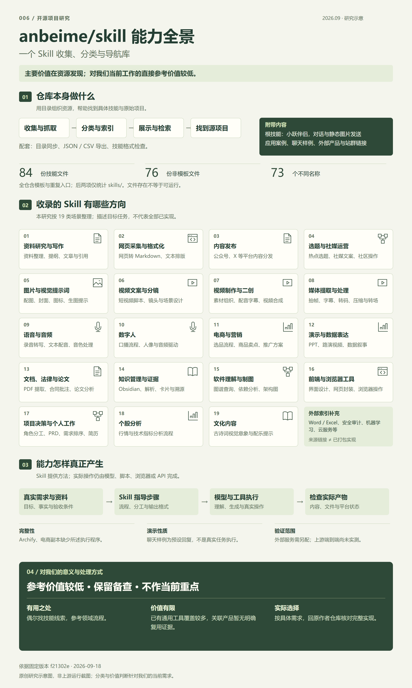

# 006 · anbeime/skill 能力研究

> Skill 收集、分类与导航库，配套目录同步、数据导出和格式检查。收录内容创作与发布、图像音视频、电商营销、文档演示、知识管理、软件开发与分析等 19 类方向。对我们当前直接参考价值较低，作为资源目录备查；具体需求回原作者仓库评估，关联产品暂无明确复用价值。

## 项目信息

| 项目 | 内容 |
| --- | --- |
| 固定编号 | `006` |
| 上游仓库 | [anbeime/skill](https://github.com/anbeime/skill) |
| 研究版本 | [`f21302e204d513d09763ebb291704eb9a2aaa34f`](https://github.com/anbeime/skill/commit/f21302e204d513d09763ebb291704eb9a2aaa34f) |
| 上游版本时间 | 2026-09-18 07:08:57 UTC |
| 上游许可证 | 根 README 声明 MIT，但该版本根目录没有独立 LICENSE；部分子目录另有许可，见[来源与许可](THIRD_PARTY_NOTICES.md) |
| 研究进度 | 已归档（本轮静态研究完成；展厅与公网已验证，上游运行未实测） |
| 技术构成 | Markdown 技能说明；Python 目录同步与辅助脚本；Node.js 对话脚本；HTML 展示；各子技能独立依赖 |
| 收录及检查日期 | 2026-09-18 |
| 在线演示 | [在线研究展厅](https://yydshly.github.io/0918_codex_project/006-anbeime-skill/) |

## 网页研究导览

[打开在线展厅](https://yydshly.github.io/0918_codex_project/006-anbeime-skill/) · [本地网页](demo/index.html) · [一图理解](https://yydshly.github.io/0918_codex_project/006-anbeime-skill/#map) · [关联网页](https://yydshly.github.io/0918_codex_project/006-anbeime-skill/#websites) · [能力分类](https://yydshly.github.io/0918_codex_project/006-anbeime-skill/#capabilities) · [文件清单](https://yydshly.github.io/0918_codex_project/006-anbeime-skill/#inventory) · [使用价值](https://yydshly.github.io/0918_codex_project/006-anbeime-skill/#workflow)

图为原创研究示意图，非上游运行截图。[高清 PNG](assets/understanding-map.png) · [可编辑 SVG](assets/understanding-map.svg)。网页支持总览图缩放、7 个网页入口说明、19 类能力搜索、84 份文件筛选，以及 3 种使用场景切换。桌面与手机布局、深链接、六项目共同构建与公网访问均已验证，见[公网记录](notes/evidence/deployment.json)。运行方式见[演示说明](demo/README.md)。

## 阅读入口

| 想了解什么 | 入口 |
| --- | --- |
| 能做什么、需要什么、边界在哪里 | [能力分类表](notes/capabilities.md) |
| 关联网页各自做什么、外部站点与技能是什么关系 | [网页关系说明](notes/web-landscape.md) |
| 仓库里实际有哪些技能文件 | [完整技能清单](notes/inventory.md) |
| 统计口径、关键机制与已发现的问题 | [研究记录](notes/research.md) |
| 对我们有什么价值、如何按需选用 | [使用与选型](notes/usage.md) |
| 固定版本、文件指纹与盘点依据 | [来源证据](notes/evidence/sources.json) |

## 核心理解

**我们的结论：参考价值较低，作为资源目录备查，不列为当前重点研究或整库集成对象。** 技能数量和关联网页数量，不能体现对我们实际工作的增益。已有能力的重复提示、缺少完整实现的技能副本，以及产品介绍链接，暂不足以形成明确的复用理由。这个判断针对我们的需求与已检查资料，不是对其他产品作全面质量评估。

这个仓库有四个需要分开看的部分：

1. **技能商店与索引**：抓取上游清单、保存技能元数据、生成分类目录和导出数据，帮助找到合适的技能。
2. **具体技能包**：`skills/` 中的提示词、工作步骤、参考材料及部分脚本，覆盖内容、视频、设计、文档、代码理解等任务。
3. **根目录伴侣技能**：根 `SKILL.md` 实际声明 `xiaoyue-companion`，通过智谱接口生成简短回复，配合 OpenClaw 发送消息及静态图片。
4. **独立应用与实验**：`projects/`、`antinet-agentteams/` 等目录。它们与技能商店并非同一个统一运行入口，本轮仅登记边界，未全面评审或运行。

因此，“发现一个技能”“拿到技能文件”“依赖安装完整”“任务执行成功”是不同阶段。下载整个仓库也不会自动获得每个子技能所声明的工具能力。

## 实际文件盘点

| 口径 | 本轮结果 |
| --- | --- |
| 全仓库精确命名为 `SKILL.md` 的文件 | 84 份，含模板及重复入口 |
| `skills/` 下排除模板后的文件 | 76 份 |
| 上述 76 份涉及的一级目录 | 65 个 |
| 上述 76 份按声明 `name` 去重 | 73 个名称；不代表 73 个独立且完整可运行的产品 |
| 仓库外部来源索引声明数 | 3,938；属于来源索引统计，不是已安装或已验证技能数 |

统计基于固定版本完整文件树和实际读取的技能文件。`._SKILL.md` 是不同文件名，不计入；子技能、嵌套目录和同名副本分别记录。详细口径及首页统计差异见[研究记录](notes/research.md)。

## 当前最重要的结论

| 关注点 | 静态检查结论 | 对使用的影响 |
| --- | --- | --- |
| 整体定位 | 技能目录与包合集，附带应用实验 | 应按具体任务挑子技能 |
| Archify | 此版本该目录只有 `SKILL.md`，所引用的渲染程序未随目录提供 | 可以研究流程，不能据此声称可直接生成图 |
| 电商全链路 | 此版本该目录只有 `SKILL.md`，示例中的 `main.py` 等未随目录提供 | 采集、上架、代发等是文档声明，未验证业务闭环 |
| 本地语音 | `qwen3-tts-local` 实际脚本调用 `edge_tts` | 名称不等于 Qwen3 模型；其“完全离线”描述不可靠 |
| 多智能体 | 部分技能定义角色、分工和输出模板 | 是否真正并发、持久记忆，取决于宿主和实现 |
| 许可 | 根声明与子目录许可需要分别核对 | 不把全库视为统一许可的原创资产 |

以上为文件和源码分析，不是端到端运行结论。各条结论的固定版本来源见[研究记录](notes/research.md)。

## 本项目范围

本轮已完成中文能力整理、技能入口盘点、7 份站内网页分析、代表性源码检查及根索引更新；已制作研究展厅，提交 GitHub 并通过 GitHub Pages 发布及公网检查。未安装上游技能、调用其模型 API，或执行上游技能中的内容发布、交易等任务。

后续若选择一个具体技能开展实验，应先核对完整包、许可和依赖，再以一个明确输入验证输出文件与实际效果，并同步本项目进度。

本目录包含原创研究说明、网页、检查脚本、截图及来源元数据，未复制上游完整源码或素材。上游运行入口与验证建议见[使用与选型](notes/usage.md)，演示状态见[演示说明](demo/README.md)。

---

[返回总项目索引](../../README.md#项目索引) · [来源与许可](THIRD_PARTY_NOTICES.md) · [素材说明](assets/README.md)
