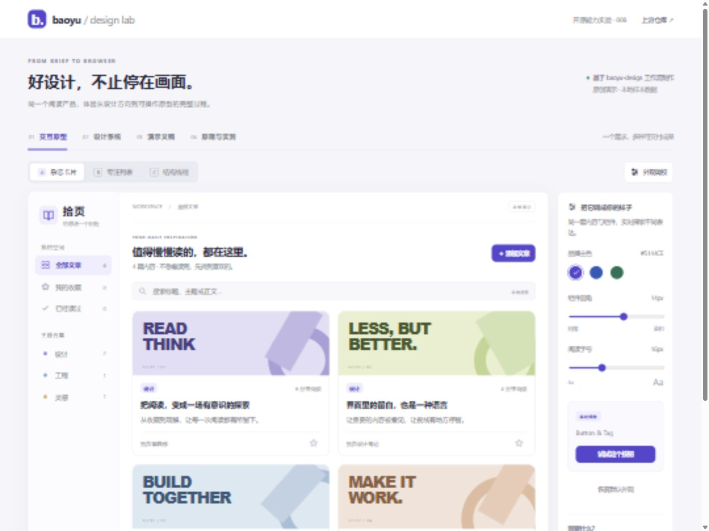

# 008 · baoyu-design

> 以 Skill 为入口的设计工作流与工具包，包含 13 类任务路由和 53 份内置技能及辅助说明。没有完整独立工作台；宿主 AI 读取指南，组合模板和脚本完成设计交付。本次制作“拾页阅读工作台”，实际演示多方向原型、设计系统编译复用，以及网页幻灯片到可编辑 PPTX 的交付。

| 项目 | 内容 |
| --- | --- |
| 上游 | [JimLiu/baoyu-design](https://github.com/JimLiu/baoyu-design) |
| 固定版本 | [`026d4ea012bdd5cada72ac8cc13f21ba4edf2245`](https://github.com/JimLiu/baoyu-design/tree/026d4ea012bdd5cada72ac8cc13f21ba4edf2245)，2026-07-30 |
| 上游许可证 | MIT，Copyright (c) 2026 Jim Liu 宝玉 |
| 收录 / 最近验证 | 2026-09-18 |
| 研究进度 | 已验证（本地交互原型、设计系统工具链、网页幻灯片与 PPTX 导出） |
| 技术栈 | 静态 HTML/CSS、React 18.3.1；上游 Node 脚本、Playwright / PptxGenJS 导出器 |
| 在线演示 | [已上线 · 能力与原理研究](https://yydshly.github.io/0918_codex_project/008-baoyu-design/) |

## 研究概要

| 方面 | 我们的理解 |
| --- | --- |
| 库的能力 | 将设计方法、品牌与组件规范组织成 Skill，并提供模板、设计系统工具及导入导出脚本，供现有 AI 助手调用。 |
| 可实现目标 | 覆盖界面与移动原型、线框图、配色字体系统、幻灯片、文档简历、动画、3D、研究、图表、邮件和宣传单，共 13 类任务入口。 |
| 实现原理 | 从通用流程到专项细节按需加载；项目规范提供共同依据，AI 编写代码并调用工具，浏览器反馈推动修正。五层约束包含流程、项目规范、专项规则、代码机制和检查。 |
| 对我们的意义 | 借鉴分层 Skill、持久化项目规范和重复操作脚本化；复用真实组件与工具，用任务完成度、一致性和修改成本判断价值。 |
| 能力边界 | 53 份文件含协议与兼容说明，不等于 53 个独立功能；没有完整独立工作台，未包含完整业务后端，覆盖广也不代表全路径已验证。 |

首次发布版本：`19023eea28c7931453eb5878f2e7627b31e983a3`。2026-09-18 已核验公网七项目入口、本项目概要、引导图、资料与下载文件；见[部署记录](notes/evidence/deployment.json)。

## 先理解，再体验

- [我们的理解](notes/understanding.md)：本质、与前端 Skill 的区别、13 类目标、53 份说明目录、内部原理与边界。
- [交互理解指南](https://yydshly.github.io/0918_codex_project/008-baoyu-design/#principle)：查看可缩放完整引导图、五层统一约束，切换任务查看 Skill 组合，展开完整目录。该网页为研究导览，不运行 AI。
- [实际工具与验证研究](notes/research.md)：真实执行链路、发现的问题、证据与限制。

## 直接体验

- [在线研究首页](https://yydshly.github.io/0918_codex_project/008-baoyu-design/) · [完整引导图](https://yydshly.github.io/0918_codex_project/008-baoyu-design/#u-map) · [五层统一约束](https://yydshly.github.io/0918_codex_project/008-baoyu-design/#u-unified)
- [在线原型](https://yydshly.github.io/0918_codex_project/008-baoyu-design/#prototype) · [设计系统](https://yydshly.github.io/0918_codex_project/008-baoyu-design/#system) · [幻灯片与 PPTX](https://yydshly.github.io/0918_codex_project/008-baoyu-design/#slides)

本地查看时，在仓库根目录启动：

```powershell
python -m http.server 8878 --bind 127.0.0.1
```

- [打开设计实验室](http://127.0.0.1:8878/projects/008-baoyu-design/demo/)
- [打开四页幻灯片](http://127.0.0.1:8878/projects/008-baoyu-design/demo/deck.html)
- [上游工具生成的组件预览](http://127.0.0.1:8878/projects/008-baoyu-design/code/reader-kit/preview.html)
- [下载实际导出的可编辑 PPTX](demo/downloads/shiye-design.pptx)

浏览成品无需安装 npm 依赖，页面及生成预览所需的 React 已包含在项目中。外部研究链接需要网络。

## 一张图理解

[](assets/understanding-map.png)

原创研究总览，覆盖 13 类目标、五层统一约束、执行过程、53 份说明及对我们的意义。不是上游产品截图。[高清 PNG](assets/understanding-map.png) · [可缩放 SVG](assets/understanding-map.svg) · [网页缩放导览](https://yydshly.github.io/0918_codex_project/008-baoyu-design/#u-map)。

## 真实效果



*本项目原创原型的运行截图，不是上游网站截图。视觉方向参考上游 Reader App 示例需求；文章为原创样本，未抓取外部内容。*

## 建议按这个顺序演示

先阅读默认打开的“理解与原理”和完整引导图，再进入下列实测演示。

1. 在“交互原型”切换杂志卡片、专注列表、结构线框，比较同一需求的三种表达。
2. 收藏文章，点击“我的收藏”；搜索不存在的关键词，观察空状态；打开文章并标为已读。
3. 添加自己的文章，刷新查看保留结果；自建文章可在阅读页删除。链接只保存为参考，不会抓取。
4. 调整主色、圆角、字号；进入“设计系统”，查看相同编译组件如何复用。
5. 打开完整组件预览，点击“保存文章”测试按钮；该单文件由上游 `build-preview.mjs` 生成。
6. 播放四页幻灯片，第三页用 → 依次展开三步动画；下载 PPTX 查看可编辑文本和形状。
7. 查看“理解与原理”，切换 13 类目标、展开 53 份说明，区分文字约束、代码机制与运行证据。

## 哪些是上游能力，哪些是本项目实现

| 内容 | 来源与验证 |
| --- | --- |
| 阅读产品设计、三种布局、交互与演示文案 | 本项目依照上游技能流程制作；非上游预置应用 |
| Button / Tag 和 15 个变量 | 本项目原创设计系统，由上游原版编译、检查、导入脚本处理 |
| 单文件设计系统预览 | 上游 `build-preview.mjs` 实际生成，已验证组件按钮响应 |
| 幻灯片缩放、翻页、分步动画 | 直接复用原版 `deck-stage.js`，未修改该文件 |
| 可编辑 PPTX | 上游原版 `gen-pptx` 实际导出；4 页、3 个动画，XML 检查包含文本和形状 |
| AI 摘要、图片生成、真实 Figma 导入、Canva / Figma 导出、视频 | 本次未接入、未验证 |

原型数据只存当前浏览器。编译器检查通过不代表任意页面都符合设计系统；PPTX 结构验证不代表已在桌面 PowerPoint 中核验字体与动画播放。

## 研究结果

- 核心价值是将设计方法和参考资料约束到代码生成，再用浏览器反馈与工具完成交付；它不附带独立的设计模型。
- 设计系统工具链可离线工作，生成可复用组件包、清单、检查规则和单文件预览。
- 实测发现纯中文预览分组名会碰撞：本项目采用英文前缀规避，未修改上游工具。详见[研究记录](notes/research.md)。
- 独立页面关闭了幻灯片编辑缩略栏：该栏的结构编辑依赖宿主确认机制，本次只演示可独立工作的播放功能。

[完整研究](notes/research.md) · [设计任务书](notes/brief.md) · [运行与复现](demo/README.md) · [工具记录](notes/evidence/upstream-tools.json) · [浏览器验证](notes/evidence/browser.json) · [第三方声明](THIRD_PARTY_NOTICES.md)

---

[返回总索引](../../README.md#项目索引)
