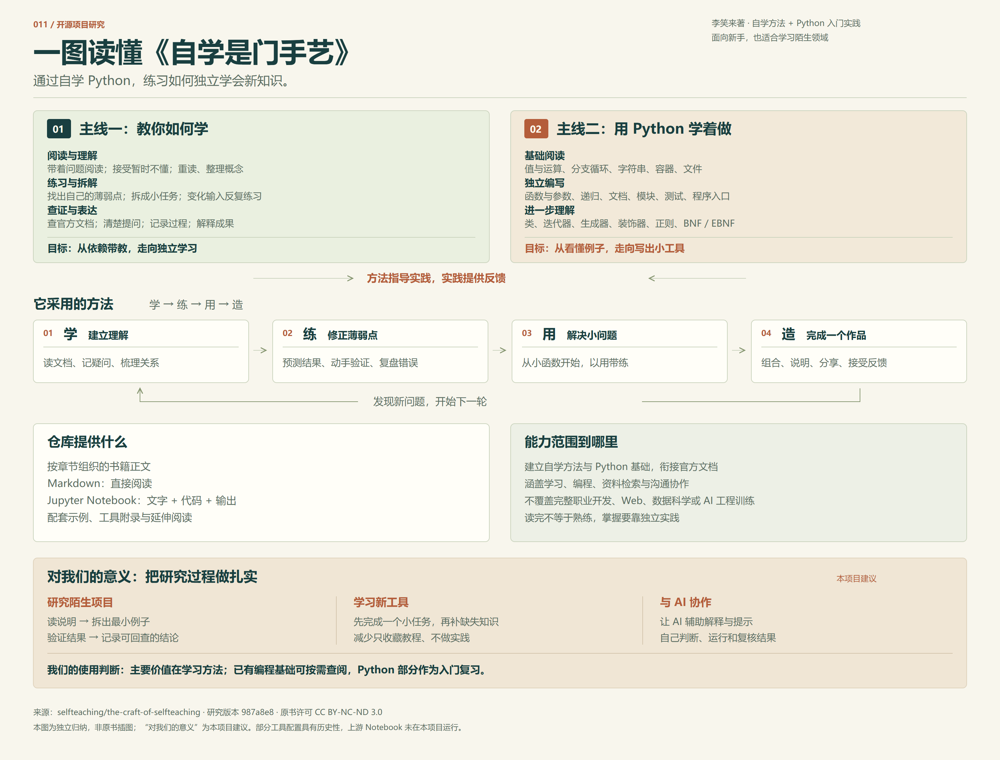
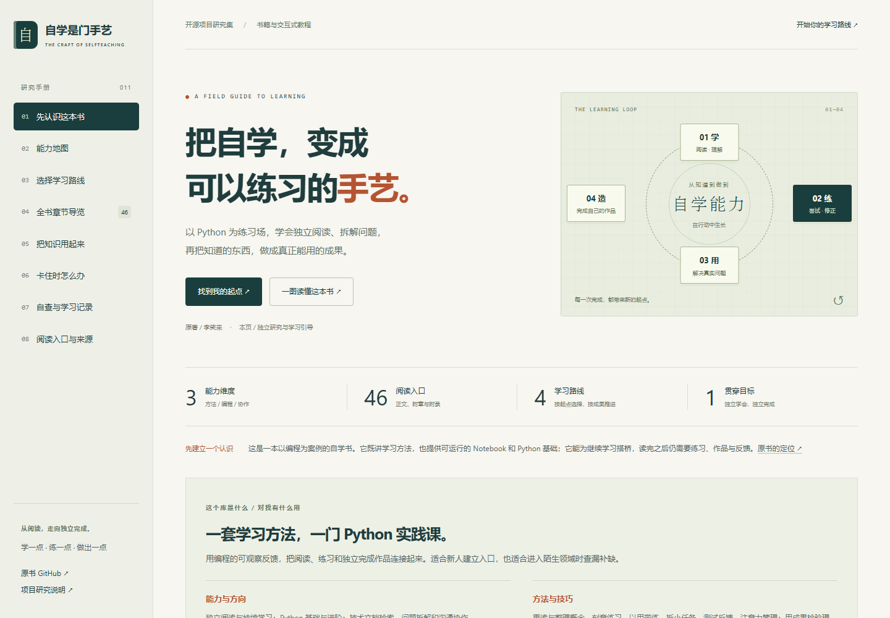

# 011 · 自学是门手艺

以 Python 为实践载体的自学书，训练独立阅读、问题拆解、代码实践与持续学习。覆盖学习方法、Python 基础与进阶、文档检索和沟通协作；技巧包括重读整理、刻意练习、以用带练、任务拆解、测试反馈与注意力管理。提供 Markdown 正文、Jupyter Notebook、代码示例、工具附录及延伸阅读。对我们主要是研究陌生项目、学习新工具和复核 AI 结果的方法参考；已有编程基础可按需查漏，不必当作完整职业课程从头学习。

| 项目 | 内容 |
| --- | --- |
| 上游 | [selfteaching/the-craft-of-selfteaching](https://github.com/selfteaching/the-craft-of-selfteaching) |
| 研究版本 | [`987a8e8a9ce205b63886510e145437d14d8a13a4`](https://github.com/selfteaching/the-craft-of-selfteaching/tree/987a8e8a9ce205b63886510e145437d14d8a13a4) |
| 原书作者与许可 | 李笑来；[CC BY-NC-ND 3.0](https://creativecommons.org/licenses/by-nc-nd/3.0/deed.zh)，按固定版本 README 声明 |
| 收录日期 | 2026-09-18 |
| 技术栈 | 原生 HTML / CSS / JavaScript；Python 标准库生成静态正文 |
| 内容范围 | 原书目录 46 个正文、附章和附录入口，不计封面、README、TOC |
| 研究进度 | 已验证（内容研究、网页交互与公网访问；上游 Notebook 未运行） |
| 在线演示 | [能力与学习指南](https://yydshly.github.io/0918_codex_project/011-selfteaching/) · [一图理解](https://yydshly.github.io/0918_codex_project/011-selfteaching/overview.html) |

## 一图理解

[](https://yydshly.github.io/0918_codex_project/011-selfteaching/overview.html)

核心是两条相互配合的主线：**教人如何学习新知识，用 Python 入门作为实践**。借助“学、练、用、造”积累独立完成任务的能力。对我们主要是学习与研究方法参考；已有编程基础时，Python 部分可以按需复习。

图为原创矢量排版的独立归纳图，非原书插图。“对我们的意义”是本项目建议。[放大与下载](https://yydshly.github.io/0918_codex_project/011-selfteaching/overview.html) · [完整文字说明](notes/understanding.md) · [矢量 SVG](assets/understanding-map.svg) · [制作记录](assets/understanding-map.prompt.md)。

## 使用指南

[打开在线能力与学习指南](https://yydshly.github.io/0918_codex_project/011-selfteaching/)，建议依次浏览“能力地图 → 学习路线 → 章节导览 → 实践任务 → 成果自查”。

- **三类能力与九个细分方向**：自学方法、Python 实践、资料与协作；每项含可观察的结果和原文依据。
- **四条路线**：零基础学编程、建立学习方法、从代码到工具、系统阅读全书；每一步列出阅读入口与达成标志。
- **46 个完整章节入口**：摘要、动手建议、固定版本 Markdown 与 Notebook 链接；支持搜索、能力分类、当前路线与未读筛选。
- **三个原创实践任务**：文本整理器、日志摘要器、陌生项目指南；明确输入输出、执行步骤和验收条件。
- **七种学习卡点**：提供下一步行动，连接到相关章节。
- **八项成果自查与学习笔记**：浏览器本地保存、Markdown 导出、带确认的清空；阅读标记与能力自查分别记录。
- **阅读环境与来源**：原书入口、当前工具文档、历史内容提醒、固定提交及验证边界。



图为本项目网页真实截图；学习循环是原创 CSS 信息图，非原书封面。[手机截图](assets/mobile.png) · [图片来源](assets/README.md)。

## 本地使用

可以直接用浏览器打开 `demo/index.html`。推荐在仓库根运行：

```powershell
python -m http.server 8770 --bind 127.0.0.1
```

访问 [本地预览](http://127.0.0.1:8770/projects/011-selfteaching/demo/)。无需前端安装或联网加载依赖，外部原书链接需要网络。

记录只保存在当前浏览器当前源；不同端口、浏览器或设备不共享。隐私设置阻止存储时会给出提示，页面仍可使用并导出。无 JavaScript 时可以阅读静态内容与全部章节，无法切换路线或保存记录。

## 研究结论与范围

这本书的价值是用编程提供反馈，把“知道学习方法”落实到阅读、练习、使用和创造。它能帮助建立继续阅读官方文档的能力，不能代替长期实践或完整的软件工程训练。

本项目阅读并核对原书章节，编写独立的能力摘要与引导内容，没有复制全书或原书图片。路线、练习、验收、自查和 AI 协作建议是本项目补充，不代表作者原话或官方课程。没有执行上游 Notebook，也没有验证学习效果。部分历史配置应参考当前官方文档；网页特别提示字典插入顺序等版本差异。

[研究记录](notes/research.md) · [来源与文件校验](notes/evidence/upstream.json) · [网页检查](notes/evidence/browser.json) · [编号入口检查](notes/evidence/integration.json) · [运行与维护](demo/README.md)。

[返回总索引](../../README.md#项目索引)

## 发布与验证

首次功能发布版本 `6abb6e6343cf5922a300cb6ff908fbc855f669f0`，通过[现有 Pages 工作流](https://github.com/yydshly/0918_codex_project/actions/runs/35362960262)部署，保留此前九个展厅。已验证十个项目入口、24 项 HTTP 资源、总站及项目摘要、PNG/SVG 图像，以及线上路线、筛选、进度保存、笔记导出、缩放下载和手机布局。

[公网部署记录](notes/evidence/deployment.json) · [线上学习交互](notes/evidence/remote-browser.json) · [线上图像交互](notes/evidence/remote-map.json)。网页发布不代表上游 Notebook 已运行或学习成效已验证。
