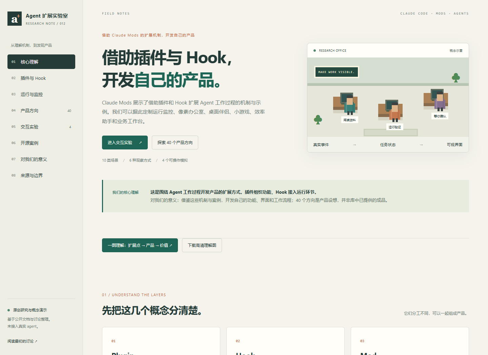

# 012 · Agent 扩展实验室

Claude Mods 展示借助插件和 Hook 扩展 Agent 工作过程的机制与示例。可定制运行监控、像素办公室、桌面伴侣与小游戏、效率与安全助手、协作调度、研究交付及业务工作台等产品。本页整理 10 类 40 个产品方向、六种观察方式与四个原创模拟；对我们的意义是借鉴这些机制开发自己的产品，而不是研究 Agent 的通用能力分类。

## 查看网页

- [在线产品扩展指南](https://yydshly.github.io/0918_codex_project/012-agent-extension-lab/) · [放大理解图](https://yydshly.github.io/0918_codex_project/012-agent-extension-lab/assets/understanding-map.svg) · [运行说明](demo/README.md)
- [研究记录](notes/research.md) · [来源与许可](THIRD_PARTY_NOTICES.md)
- 状态：已上线，网页交互、理解图与公网访问已验证；未连接真实 Agent，未安装运行上游软件。

## 内容与能力

[一图理解：运行扩展点、产品方向与开发价值](assets/understanding-map.png) · [可放大 SVG](assets/understanding-map.svg) · [文字说明](notes/understanding-map.md)。图为原创归纳，非真实运行截图。

八个章节覆盖核心理解、插件与 Hook、运行与监控、产品方向、交互实验、开源案例、对我们的意义、来源与边界。包含 10 类、40 个产品设想，每项说明用户、问题、流程、实现方式、最小版本、产出、边界和衡量方法；支持分类、关键词、复杂度联合筛选和 Markdown 导出。

六种观察方式包括 Hooks、会话日志、SDK/API、工作流状态、链路追踪和进程/心跳。四个原创模拟演示：

| 演示 | 可操作效果 | 验证的理解 |
| --- | --- | --- |
| Hook 流程 | 正常读取、脱敏、越界阻止，逐步查看事件 | 接入点决定可观察或修改的范围 |
| 像素办公室 | 三个角色、回放、权限等待、确认续接、失败与失联 | 角色状态必须来自事件；结束不等于成功 |
| 桌面伴侣与小游戏 | 角色状态、翻牌配对、等待或结束后暂停 | 娱乐界面可以联动运行事件；不是任务调度器 |
| 交付验收台 | 缺失证据、自动检查齐全、检查失败三种样本 | 运行结束后仍需检查证据与人工审阅 |

真实案例提供仓库与效果图入口：Pixel Agents、Claude Office、cc-arcade，以及补充案例。站内演示均为独立实现，不嵌入或复制这些项目。

## 上游与研究版本

资料核验日期：2026-09-18。研究版本是资料参照版本，不代表已安装该版本。

| 来源 | 研究提交 | 许可 |
| --- | --- | --- |
| [Claude Code / Mods](https://github.com/anthropics/claude-code/issues/91870) | `31a3b00bef145a0393d9dbf840a98674fec07712` | Anthropic 保留权利，使用受商业服务条款约束；不能按 MIT 处理 |
| [Pixel Agents](https://github.com/pixel-agents-hq/pixel-agents) | `3537e140c2094761beae748592aeb92ece8edfdd` | MIT |
| [Claude Office](https://github.com/paulrobello/claude-office) | `3522c16399660ac787cd1f4ad4f3255352ec8e6c` | MIT |
| [cc-arcade](https://github.com/sezaakgun/cc-arcade) | `0baff06d31295850283c2eebe052f39bbc35473f` | MIT |

## 验证与限制

[浏览器记录](notes/evidence/browser.json)验证内容数量、联合筛选、下载内容、四个演示的主要分支、键盘切换、五档宽度、页面刷新与内部锚点。截图来自本地原创网页：[办公室](assets/office-demo.png)、[手机](assets/mobile.png)。

沿用既有构建器和 GitHub Pages 工作流发布，保留 11 个静态展厅。首次功能发布版本 `755b0af4894c014ad4f841e75c1778edb089526a`，2026-09-19 核验全部项目入口、25 项 HTTP 资源、摘要、PNG/SVG 字节一致性，以及四演示、筛选与导出、键盘操作和手机布局。[公网记录](notes/evidence/deployment.json) · [线上交互](notes/evidence/remote-browser.json) · [发布流程](https://github.com/yydshly/0918_codex_project/actions/runs/35368219127)。

产品方向属于研究归纳，复杂度属于设计判断；没有市场需求、收入或真实代理性能方面的实测结论。静态页面不读取工作区、终端、模型或真实日志。对我们的核心价值是据此开发自己的产品；结合本仓库，可以选择“项目研究助手＋状态可视化＋交付验收”作为起步场景。
