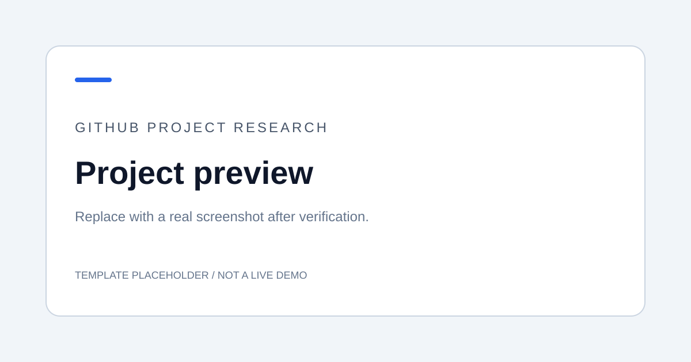

# 待填写编号 · 待填写项目名称

> 待填写：用一两句话说明这个项目解决什么问题，以及本次研究关注什么。
>
> 本目录是可复制模板，不属于已收录研究项目。复制后删除这条模板提示。

## 项目信息

| 项目 | 内容 |
| --- | --- |
| 固定编号 | 待填写，例如 `001` |
| 上游仓库 | 待填写 GitHub 链接 |
| 上游许可证 | 待核实 |
| 研究版本 | 待填写 tag / commit |
| 研究进度 | 待研究 |
| 技术栈 | 待填写 |
| 收录日期 | 待填写，格式 YYYY-MM-DD |
| 最近验证日期 | 尚未验证 |
| 在线演示 | 未部署 |

## 效果预览

*当前为模板占位图。完成运行后替换为真实截图，并在这里说明界面、操作场景与结果。*

## 为什么研究

- 待填写：值得研究的能力或设计。
- 待填写：希望解决的实际问题。
- 待填写：本次研究的范围和预期产出。

## 快速开始

尚未添加可运行代码。完成实践后填写：

1. 系统、语言运行时与版本要求。
2. 依赖安装与配置步骤。
3. 启动命令、执行目录和访问入口。
4. 最小验证步骤及预期结果。

实验代码放在 [code/](code/)，Web 演示说明放在 [demo/](demo/)。根据真实技术栈填写可复现的命令。

## 研究记录与结论

详细过程见[研究笔记](notes/research.md)。

| 关注点 | 当前结论 | 验证依据 |
| --- | --- | --- |
| 待填写 | 尚未验证 | 待补充 |

## 后续计划

- [ ] 核实上游来源、许可证与研究版本
- [ ] 完成本地运行并记录环境
- [ ] 分析关键机制并完成最小实验
- [ ] 添加真实截图和图片来源
- [ ] 汇总研究结论与限制
- [ ] 如需 Web 演示，完成部署并验证访问
- [ ] 更新总项目索引和图览

## 来源与改动

待填写：第三方代码或素材的来源、许可证、本项目改动范围。尚未引入上游代码。

---

[返回总项目索引](../../README.md#项目索引) · [图片来源](assets/README.md) · [部署说明](demo/README.md)
